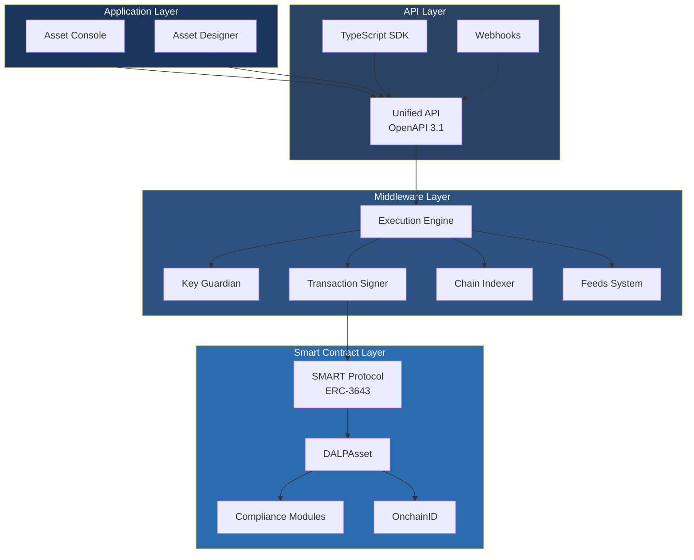
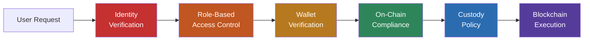

# Platform Architecture and Security

## Why Architecture Matters for Institutional Tokenization

Regulated financial institutions face a structural challenge when evaluating tokenization platforms: most available solutions were designed for DeFi use cases and retrofitted for institutional requirements, leaving compliance enforcement at the application layer where it can be bypassed, and coupling asset logic to a single blockchain network. DALP was designed from the outset for regulated securities. Its four-layer architecture enforces compliance at the smart contract level, separates token logic from network infrastructure, and provides the operational controls that risk committees and compliance officers require before approving production deployment. The result is a platform where every transfer is compliance-verified before execution, every action is auditable, and every component can be independently secured.

## Architectural Overview

DALP is built as a four-layer stack where each layer enforces its own security controls independently. Requests flow top-down through these layers: a user action in the Asset Console triggers an API call, which the middleware orchestrates into one or more blockchain transactions, which the smart contract layer validates and executes on-chain. Because each layer independently enforces its own security controls, no single-layer failure grants unauthorized access.

| Layer | Role | Key Capabilities |
|-------|------|-----------------|
| **Application** | Operator, issuer, and compliance officer interfaces | Asset Console (web UI), Asset Designer wizard, four-locale internationalization |
| **API** | Programmatic access for external systems | Unified API (OpenAPI 3.1), TypeScript SDK, webhooks, enterprise messaging |
| **Middleware** | Workflow orchestration, key management, indexing | Execution Engine, Key Guardian, Transaction Signer, Chain Indexer, Feeds System |
| **Smart Contract** | On-chain enforcement of compliance, identity, and asset logic | SMART Protocol (ERC-3643), DALPAsset contracts, compliance modules |

This layered separation means that integration teams can connect to the API layer without understanding blockchain internals, compliance officers can configure rules through the application layer without modifying smart contracts, and security teams can audit each layer against its own control objectives.

*Figure 1: DALP four-layer architecture. Each layer enforces independent security controls. Requests flow top-down; no single-layer failure grants unauthorized access.*

## Smart Contract Layer

### SMART Protocol Foundation (ERC-3643)

Institutions considering tokenization need assurance that compliance is not merely an application feature that could be circumvented, but a protocol-level guarantee enforced on every transaction. DALP addresses this through the SMART Protocol (SettleMint Adaptable Regulated Token), an implementation of the ERC-3643 standard that requires every transfer to pass through a modular compliance engine before execution.

SMART Protocol provides three foundational sub-layers. The token layer implements ERC-20 compatible contracts with compliance hooks and a modular extension system, so external systems such as wallets, exchanges, and indexers interact through standard interfaces. The compliance layer orchestrates a configurable set of transfer rules evaluated before each transaction, and these rules can be added, removed, or reconfigured at runtime without redeploying the token contract. The identity layer manages on-chain identity through OnchainID (ERC-734/735), storing verifiable KYC/AML claims that are enforced as a prerequisite for transfers.

This design means that compliance officers can update jurisdiction-specific transfer rules without requiring engineering involvement, contract redeployment, or downtime. For institutions operating across multiple regulatory frameworks, this runtime reconfigurability eliminates the technical bottleneck that typically delays regulatory compliance updates.

### DALPAsset: Runtime Configurability

For operations teams evaluating deployment flexibility, DALPAsset offers a significant advantage: it eliminates the need to commit to a specialized contract type at deployment time. The contract extends the SMART Protocol with runtime-pluggable token features that integrate through six lifecycle hooks (mint, burn, transfer, redeem, update, attach). Verified features include historical balances, voting power, permit (gasless approvals), AUM fee, maturity and redemption, fixed treasury yield, and transaction fee variants.

A DALPAsset token can evolve over its lifetime. An institution might start with a simple bearer instrument, then add fee structures as the business model matures, enable governance when stakeholder voting becomes necessary, or configure maturity and redemption logic as the asset approaches its lifecycle end. All of these changes happen through configuration under governance control, not through contract redeployment.

### Deterministic Deployment

All asset types deploy through a factory pattern using CREATE2 deterministic addressing. The factory wraps proxy deployment, identity registration, compliance initialization, and role assignment into a single atomic transaction. Token addresses are predictable from deployment parameters, which means custody providers, compliance systems, and reporting tools can be pre-configured before deployment completes. If any step fails, the entire deployment reverts, so no partially deployed tokens can exist on-chain. This atomic guarantee eliminates the operational risk of tokens entering circulation before compliance configuration is complete.

## Middleware Layer

The middleware sits between the API surface and the blockchain networks, handling the operational complexity that institutions cannot expose to end users or external integrators: workflow orchestration, cryptographic key management, transaction signing, event indexing, and multi-network routing.

### Workflow Orchestration

The Execution Engine provides reliable workflow orchestration with persistent state and exactly-once semantics through a durable workflow engine. All stateful operations run as durable workflows that survive infrastructure failures, process restarts, and network partitions. For institutions with zero-tolerance for lost transactions, this means that a settlement instruction submitted during a network disruption will complete automatically when connectivity returns, without manual intervention or reconciliation.

### Key Management and Transaction Processing

The Key Guardian manages cryptographic key storage with integration across AWS, Azure, and GCP cloud KMS services, along with HSM support for regulated deployments requiring FIPS 140-2 Level 3 compliance. The Transaction Signer handles transaction preparation, gas estimation, nonce management, and signing with EIP-1559 support and meta-transaction capability (ERC-2771), enabling gasless workflows for investors.

Nonce coordination serializes allocation per address and chain ID through the durable workflow engine, with self-healing behavior for conflicts that re-reads on-chain state, advances, and retries up to three times before surfacing a terminal error. An external signer abstraction normalizes operations across local, DFNS, and Fireblocks custody backends, making custody providers interchangeable through configuration.

### Blockchain Indexing

A blockchain indexer processes on-chain events, translates data, and projects queryable state. One indexer instance operates per chain ID, maintaining isolation across networks. The Chain Gateway provides multi-network connectivity with failover and load balancing across RPC providers.

## API Layer

### Unified API

The Unified API exposes all platform capabilities through a type-safe, documented interface with OpenAPI 3.1 specifications generated directly from procedure definitions. This means documentation stays synchronized with implementation automatically. Interactive exploration is available through Swagger UI at the API endpoint.

Three authentication methods are supported: session-based authentication (browser), API keys (system integration), and enterprise SSO. Blockchain-writing operations additionally require wallet verification, ensuring that even with valid API credentials, no on-chain transaction executes without explicit user authorization.

For institutions seeking gasless investor experiences, meta-transaction support through ERC-2771 integration allows callers to submit signed transaction payloads without holding native tokens for gas. A configured relayer service sponsors transaction costs, removing a common barrier to institutional adoption.

### Integration Surface

| Method | Use Case | Authentication |
|--------|----------|----------------|
| REST API (OpenAPI 3.1) | System-to-system integration | API keys, session auth, SSO |
| TypeScript SDK | Node.js applications, rapid development | API keys |
| Webhooks | Event-driven notifications | Configured per endpoint |
| Enterprise messaging | Standards-based integration with financial infrastructure | API keys |

The TypeScript SDK provides a typed client factory, automatic serialization of blockchain value types (arbitrary-precision decimals, BigInt, Date), and support for all API namespaces. It targets Node 20+ with ESM module format.

## Security Architecture

### Defense-in-Depth Model

For risk committees evaluating platform security, DALP's defense-in-depth model provides a critical assurance: no single point of compromise grants access to digital assets. Five independent control layers must all pass before any transaction reaches the blockchain.

*Figure 2: Five-layer defense-in-depth. Each layer operates independently. A compromised session is blocked by wallet verification; a bypassed API check is blocked by on-chain compliance; custody policies provide the final gate.*

A compromised session token is blocked by wallet verification. A bypassed API authorization check is blocked by on-chain compliance. Custody provider policies provide the final gate before any transaction reaches the blockchain. This independence means that security teams can audit each layer against its own control objectives and threat model.

### Authentication

The platform supports phishing-resistant passkey authentication (WebAuthn/FIDO2), corporate directory integration (LDAP/Active Directory), and enterprise SSO (OAuth 2.0/OIDC, SAML 2.0). Browser sessions use HTTP-only cookies with Secure and SameSite attributes, expiring after 7 days with a 24-hour refresh window. Machine-to-machine integrations authenticate with scoped API keys, hashed in storage, rate-limited at 10,000 requests per 60-second window.

### Wallet Verification

Beyond session authentication, DALP enforces a dedicated second factor for all blockchain write operations. Even with a valid authenticated session, no on-chain transaction executes without the user proving wallet control through PIN, TOTP (RFC 6238), backup codes, or passkey challenge-response. There is no administrative override that skips this step. Recovery requires backup codes or credential re-enrollment. This ensures that a stolen session cannot be used to execute unauthorized transactions, which is the scenario that keeps treasury operations teams up at night.

### Role-Based Access Control

Authorization operates through dual-layer permissions where off-chain platform roles control API and console access while on-chain Solidity roles govern blockchain operations. The on-chain AccessManager contract is the authoritative source for all 26 role assignments, organized across platform, system, per-asset, and module layers. This dual-layer model means that role assignments are verifiable on-chain, providing the evidential basis that regulated audit processes require.

Multi-tenant isolation is enforced at the database query level on every API request. Cross-tenant operations are not possible, so each tenant maintains isolated membership, roles, assets, compliance records, and audit trails.

### Key Management and Custody

The Key Guardian service manages cryptographic material through four escalating security tiers:

| Tier | Protection | Use Case |
|------|-----------|----------|
| Encrypted database | Application-level encryption | Development and proof-of-concept |
| Cloud secret manager | Platform-managed encryption | Standard production deployments |
| HSM | FIPS 140-2 Level 3 | Regulated financial services |
| MPC custody (DFNS, Fireblocks) | Institutional multi-party computation | Highest security requirements |

Organizations select their tier based on regulatory obligations, and mixed deployments are supported: HSM for treasury operations alongside database keys for automated processes. Both DFNS (threshold MPC with distributed key shards) and Fireblocks (MPC-CMP with continuous key refresh) ensure that no single private key ever exists in one place.

A unified signer interface abstracts over all custody backends. Adding a new custody provider requires implementing the signer adapter, not changing platform workflows. This means institutions are not locked into a single custody vendor.

### Observability

The platform provides a three-pillar observability stack: time-series metrics for operational monitoring, structured JSON logs with correlation identifiers for forensic analysis, and distributed traces for cross-component issue isolation. Pre-built dashboards cover operations, transactions, compliance activity, security events, and infrastructure health. Alert routing delivers critical notifications to incident management systems, warnings to team channels, and informational alerts via email.

### Compliance Certifications

SettleMint holds ISO 27001 certification for information security management and SOC 2 Type II certification confirming that security controls operate effectively over extended audit periods. The Type II distinction matters: it verifies not just that controls are designed, but that they are consistently enforced over time, providing the assurance that procurement and compliance teams require before approving a technology vendor for production deployment.

### Disaster Recovery

The recommended cloud-native deployment uses managed container orchestration with multi-availability-zone distribution, achieving RTO of 2 to 15 minutes and RPO of seconds to 1 minute through synchronous replication. Geographic redundancy via hot-warm active-standby clusters provides failover across regions. All critical operations run as durable, deterministic workflows with configurable retry handling and exponential backoff, ensuring completion even through transient infrastructure failures. Supported cloud providers include AWS, Azure, GCP, and OpenShift environments.

## Network Support

DALP operates on any blockchain implementing the Ethereum JSON-RPC specification without application code changes. This network-agnostic design means that institutions can begin development on one network and move to a different one if regulatory guidance changes, without re-architecture.

Supported networks span Layer 1 mainnets (Ethereum, Polygon PoS, Avalanche C-Chain, BNB Smart Chain), Layer 2 rollups (Arbitrum, Optimism, Base, zkSync Era, Polygon zkEVM), and private/consortium networks (Hyperledger Besu with IBFT 2.0/QBFT, Geth with Clique PoA). Multi-chain operation maintains identity, compliance, and indexer isolation per chain, so an institution running assets on both a public Layer 2 and a private consortium network operates them from a single platform with consistent compliance enforcement across both.

Because compliance modules operate at the application layer rather than the contract layer, the same rules apply regardless of the underlying chain. This is the architectural decision that enables multi-network deployment without multiplying compliance complexity.
