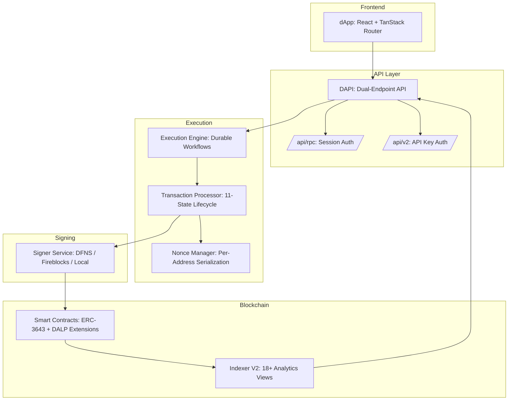
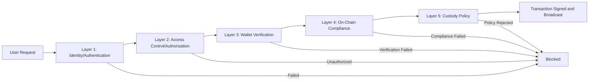

# Section 6: Technical Proposal: Loop 2 Refresh

## Executive Summary

The preceding section established how DALP enforces identity verification and compliance at the protocol level. This section examines the infrastructure that makes those guarantees operationally sustainable: the platform architecture, deployment models, security layers, high availability, and integration capabilities that institutional operations teams evaluate before committing to a technology decision.

The core question for any technical evaluation committee is straightforward: can this platform meet the same operational standards that traditional financial systems have spent decades establishing? Availability measured in four nines. Security controls spanning five independent layers. Deployment models that respect data sovereignty. Upgrade paths that do not require taking the platform offline, redeploying existing assets, or disrupting holders' balances.

DALP is built to answer that question with verifiable evidence. The platform runs on Kubernetes (standard distributions and Red Hat OpenShift), supports cloud, on-premises, and hybrid deployments, and integrates with institutional infrastructure including HSM-backed key management, enterprise observability stacks, and existing identity providers. A 534-code structured error catalog provides immediate, actionable feedback for every failed operation. Distributed tracing across four tracer namespaces instruments every step from API entry through custody provider signing, giving operations teams diagnostic capability across trust boundaries they do not control.

---

## 6.1 Platform Architecture Overview

### Architectural Principles

Five foundational principles shape every design decision. **Lifecycle-first design** ensures that every component serves the full digital asset lifecycle from issuance through servicing to retirement. This distinction matters because platforms designed only for token creation accumulate operational debt when clients need ongoing compliance monitoring, corporate actions, and asset maturity handling. **Durable execution** means all stateful operations persist their phase state so failures produce resume points, not lost work. **Defense-in-depth** enforces security at five independent layers. **Separation of concerns** makes each component independently deployable and scalable. **Provider abstraction** prevents vendor lock-in across custody, secrets, storage, and database.

### Core Components

*Figure 1: DALP platform architecture. The dual-endpoint API creates a hardened security boundary between browser sessions and programmatic access. Durable workflows guarantee operation completion through infrastructure failures.*

**The dApp** provides the operational console with sophisticated client-side logic: effective-status derivation compensating for indexer lag, arbitrary-precision arithmetic (avoiding floating-point errors in financial calculations), five-tab addon consoles, Asset Designer with multi-step validation, global search with role-aware visibility, and i18n support across 4 locales including right-to-left layout. Your operations team works with a single interface for asset management, compliance configuration, identity administration, and system monitoring.

**The DAPI** creates a hardened security boundary through dual endpoints. The RPC endpoint accepts only browser sessions; API keys are explicitly blocked with FORBIDDEN response. The REST endpoint accepts organization-scoped API keys with HTTP-method-based scope enforcement. This separation means programmatic integrations (SDK, CLI, CI pipelines) access a different endpoint with different authentication from human operators, reducing the attack surface for both.

The DAPI middleware chain transforms authenticated requests into tenant-scoped, permission-aware operations: session resolution, authentication enforcement, organization role synchronization (reconciling on-chain access-control state at request time), system context hydration, token context hydration, wallet verification (PIN, TOTP, backup codes with per-factor replay protection), and transaction queue negotiation. This layered approach means each middleware enforces its constraint independently.

**The Execution Engine** is the durable workflow runtime. Virtual objects keyed by partition provide exclusive locking during submission, preventing nonce conflicts. Durable workflows persist phase status and resume from the last checkpoint after failures. Three retry presets (fast: 5 attempts/10s; standard: 10 attempts/5min; longRunning: 20 attempts/30min) are applied per step. This durability model means token creation, identity recovery, and settlement execution survive infrastructure failures without operator intervention.

**The Blockchain Layer** implements ERC-3643 with DALP extensions: DALPAsset contracts with up to 32 pluggable features per token through the SMART Configurable system, 12 compliance module types across the three-tier compliance hierarchy, OnchainID identity contracts, system governance contracts, and factory-deployed addon contracts. The three-tier compliance hierarchy (Global → Token → SMART V2) supports incremental migration from legacy compliance interfaces.

**The Indexer V2** processes all on-chain events and provides 18+ PostgreSQL analytics views across five domains. Zero-downtime reindexing builds new data in a rotating schema alongside the running version, then switches atomically. The indexer bootstraps by querying the on-chain Directory for registered factories, discovering all contracts without manual address configuration. Your BI team can connect Looker, Tableau, or Power BI directly to these views for compliance and operational reporting.

**The Signer Service** normalizes wallet creation, signing, and approval across DFNS (full API-based MPC provisioning), Fireblocks (enterprise MPC-CMP with continuous key refresh), and local signing (encrypted storage with nonce tracking). The provider abstraction means your institution can start with one custody provider and migrate to another without application changes.

**The Transaction Processor** manages an 11-state lifecycle (RECEIVED through COMPLETED, FAILED, DEAD_LETTER, or CANCELLED) with 20 sub-statuses for granular failure classification. A shared Confirmation Watcher batch-polls receipts for up to 250 active transactions per tick, replacing per-transaction RPC loops. This shared polling reduces RPC load by orders of magnitude compared to naive per-transaction confirmation patterns.

---

## 6.2 Deployment Models

DALP supports three deployment models. The choice depends on your institution's operational capacity, regulatory requirements, and data sovereignty constraints.

### Managed Cloud (SaaS)

SettleMint operates everything: Kubernetes cluster, PostgreSQL, Redis, object storage, observability, upgrades, patching, and monitoring. Your team focuses on business operations. This is the fastest path to production and the lowest ongoing effort.

### Self-Hosted Cloud

Your team provisions infrastructure on AWS, Azure, or GCP. DALP Helm charts automatically configure for the target provider. Cloud-native identity patterns (IRSA, Workload Identity) handle service authentication without static credentials. Typical ongoing effort: 8 to 16 hours per month with 0.25 FTE.

### On-Premises

For strict data residency or security requirements. The complete stack runs in your data center: CloudNativePG for PostgreSQL (17.x), in-cluster Redis (8.x), RustFS for S3-compatible storage, full observability stack, and Velero for backups. More operational effort (0.5 FTE) but complete data sovereignty.

### Platform Support

Helm charts detect Kubernetes vs OpenShift automatically. Standard Kubernetes uses Traefik ingress; OpenShift uses native Routes with restricted-v2 Security Context Constraint compliance. Minimum: 3 nodes, 4 vCPU/16 GB each. Recommended: 6+ nodes, 8 vCPU/32 GB. These are real production requirements, not aspirational targets. The platform has been validated on these specifications.

---

## 6.3 Network Architecture

Having described deployment infrastructure, we now turn to the blockchain network layer that the infrastructure serves. DALP operates on any EVM-compatible network, abstracting blockchain complexity so business teams work with asset and workflow concepts.

Permissioned networks typically use Hyperledger Besu with IBFT 2.0 or QBFT consensus, providing deterministic block times and instant finality. This matters for compliance: your settlement team needs certainty that a confirmed transaction will not be reversed, which probabilistic consensus mechanisms cannot guarantee. Production deployments run 4 validators and 2 RPC nodes.

Multi-network support allows simultaneous operation across multiple chains. The indexer maintains per-network directory addresses and discovers contracts independently. The nonce manager partitions state by address and chain. Your institution can operate assets on different networks with a single platform instance.

Network discovery is automatic. The indexer queries the on-chain Directory for registered factories, then discovers deployed contracts through factory event logs. Factory name validation against a trusted map prevents discovery of non-DALP contracts. Operators do not maintain lists of contract addresses.

---

## 6.4 Security Architecture

### Defense-in-Depth

The compliance enforcement described in Section 5 operates within a broader security architecture. Five independent layers protect every transaction:

*Figure 2: Five-layer security model. Each layer operates independently. A compromised session is caught by wallet verification. A bypassed API authorization is caught by on-chain compliance. Custody policies provide the final gate.*

A compromised session token cannot execute transactions because wallet verification (PIN, TOTP, backup codes) is required for blockchain writes. A bypassed authorization check cannot produce a non-compliant transfer because on-chain compliance enforces rules at the protocol level. Even if all off-chain controls fail simultaneously, the custody provider's policy engine evaluates the transaction independently before signing. This layered independence is what makes the security model meaningful rather than decorative.

### Authentication

Three authentication mechanisms serve different access patterns. Browser sessions use Better Auth with email/password, passkey (WebAuthn), and enterprise SSO. API keys are organization-scoped with read-only or read-write scope, enforced by HTTP method. CLI uses browser-based device login that upgrades into a long-lived API key with secure credential storage. API keys are blocked on the RPC endpoint by design, not configuration.

### Role-Based Access Control

System roles govern platform-wide authority. Per-asset roles (admin, custodian, emergency, governance, supplyManagement) provide independent operational scope. On-chain role assignments synchronize into platform authorization at request time through organization role sync middleware. The permission model enforces both role requirements and token interface requirements, preventing operations on tokens that lack required capabilities regardless of the operator's role.

### Key Management

Key Guardian protects private keys across four storage tiers: encrypted database (development), cloud secret manager (standard production), HSM (regulated financial services), and third-party MPC custody (highest security). Key lifecycle covers generation (HSM keys within hardware; software keys via CSRNG with immediate encryption), rotation (active replacement with historical retention), recovery (sharded backups with threshold schemes), and revocation (immediate removal with smart contract permission updates). Only Transaction Signer components can request signatures; all access attempts are logged.

### Two-Layer Transaction Policy

On-chain compliance (SMART Protocol) and custodian policies (DFNS/Fireblocks) evaluate independently. The issuer configures compliance rules through the DALP API. The operations team configures custody policies in the provider dashboard. Both layers must pass. Neither can bypass the other. This separation means your compliance team and operations team each control their own enforcement domain without depending on the other's configuration.

---

## 6.5 High Availability and Disaster Recovery

### Recovery Scenarios

| Scenario | RTO | RPO | Monthly Effort | When to Use |
|----------|-----|-----|---------------|-------------|
| Cloud-native (recommended) | 2 to 15 min | Seconds to 1 min | 8 to 16 hours | Most deployments |
| Hot-warm | 30 to 180 min | 5 to 60 min | 25 to 40 hours | Geographic redundancy |
| Hot-cold | 8 to 72 hours | 4 to 24 hours | 10 to 20 hours | Cost optimization |
| Hot-hot (consortium) | 1 to 10 min | Seconds to min | 40 to 60 hours | Multi-region active |

The recommended cloud-native scenario uses multi-AZ deployment with managed services. Setup: 2 to 3 days with 1 platform engineer. Minimum 0.25 FTE ongoing. Production requires nodes across 3+ availability zones.

### Blockchain-Specific Resilience

On-chain data is inherently replicated across every blockchain node. Losing the application database does not mean losing transaction history, which can be re-derived by re-indexing from the blockchain. The indexer's rotating schema architecture enables zero-downtime re-indexing. Permissioned IBFT 2.0/QBFT networks tolerate f = (n-1)/3 Byzantine failures. These blockchain-native properties mean your DR posture is stronger than equivalent traditional infrastructure because the authoritative record (the blockchain) is inherently distributed.

### Backup Strategies

PostgreSQL PITR with 7-day retention, Velero for Kubernetes resources, versioned object storage with lifecycle policies, and WAL archiving for self-hosted deployments. Backup storage follows the formula: base storage × 59 (retention multiplier) × 0.4 (compression) × 1.2 (headroom).

---

## 6.6 Performance and Scalability

Transaction processing locks at the address-and-chain level, enabling parallel processing across addresses while serializing per-address to prevent nonce conflicts. Three execution modes (sync, async via HTTP 202, hybrid with timeout fallback) let your integration team choose the pattern that fits each workflow. Provider-native broadcast for DFNS and Fireblocks reduces latency by delegating signing and broadcast to the custody provider.

The indexer delivers sub-5-second event latency from blockchain to analytics view availability, with virtual views for real-time queries and materialized views for aggregations. Zero-downtime reindexing and reorg handling maintain data consistency through operational changes.

Components scale independently: DAPI horizontally behind load balancers, indexer with database performance, Execution Engine through partition-based addressing, RPC nodes for read scalability, and the stateless dApp without constraint. This independent scaling means your infrastructure team can address bottlenecks surgically rather than scaling the entire platform.

---

## 6.7 Monitoring and Observability

### Three-Pillar Observability

Metrics (VictoriaMetrics), logs (Loki), and traces (Tempo) provide complete visibility. Deployable in-cluster or connected to your existing managed providers (CloudWatch, Azure Monitor, GCP Cloud Monitoring).

### Distributed Tracing

Four tracer namespaces cover the platform: dalp.dapi (API calls, PostgreSQL queries), dalp.integrations.fireblocks (20+ instrumented custody calls), dalp.integrations.dfns (wallet and signing operations), and services.transaction-processor (lifecycle and queue spans). Production uses 10% sampling with parent-based propagation ensuring complete traces for sampled requests.

This architecture is particularly valuable for diagnosing delays in delegated signing flows. When your operations team investigates a slow transaction, the trace shows whether latency was in the DALP API, the workflow engine, or the external custody provider, even though DALP does not own the custody execution path.

### Monitoring Automation

Blockchain health monitoring with 3-sample hysteresis prevents false alerts. SSE provides real-time health events. Hourly API rollups track performance trends. Retention management automates cleanup. Pre-built Grafana dashboards cover six operational domains. Structured Slack alerts include severity classification, namespace context, and one-click silence links.

### Analytics Views

18+ PostgreSQL views span identity (2), compliance (4), addons (3+), cross-cutting (7), actions (1), and pricing (2+). Direct SQL access means your BI team connects their preferred tools without custom integration.

---

## 6.8 DevOps, Deployment, and Error Handling

DALP ships as Helm charts covering all operational configuration. Container images route through harbor.settlemint.com, simplifying firewall rules to a single outbound endpoint.

### Upgrade Safety

Zero-downtime reindexing (rotating schema with atomic view switch), schema registration decoupling, UUPS proxy patterns for contract upgrades without token redeployment, rolling deployment hardening for version coexistence, CI freshness checks catching drift between contracts and error catalog, and draining cleanup with 1-hour grace periods. These mechanisms mean your team can upgrade the platform during business hours without affecting users or token holders.

### Error Handling

534 auto-generated error codes from Solidity ABI definitions, each with audience classification, severity, retryability, message, and suggested action. Exposed through SDK, dApp (with i18n translations across 4 locales), and OpenAPI extensions. The revert decoder handles Error(string), Panic(uint256), and custom ABI errors with 51 mapped Panic codes. When your integration team encounters a transaction failure, the error message tells them what went wrong, whether to retry, and what action to take, in their preferred language.

### CLI and SDK

301 CLI commands across 26 groups with typed schemas. The SDK provides TypeScript bindings with DALP-specific serializers for arbitrary-precision decimals, bigint, and dates. Both bind to the same API surface, ensuring consistent behavior regardless of access method.

---

## 6.9 Operational Sustainability

| Activity | Managed Cloud | Self-Hosted Cloud | On-Premises |
|----------|--------------|------------------|-------------|
| Infrastructure | SettleMint | 0.25 FTE | 0.5 FTE |
| Database | SettleMint | Managed service | CloudNativePG |
| Backup verification | SettleMint | Weekly (30 min) | Weekly (30 min) |
| Helm updates | SettleMint | Monthly (1 to 2 hours) | Monthly (1 to 2 hours) |
| DR drill | SettleMint | Quarterly (4 to 8 hours) | Quarterly (4 to 8 hours) |
| Total monthly | Minimal | 8 to 16 hours | 16 to 32 hours |

Self-healing capabilities reduce operational burden: nonce recovery (automatic retry up to 3 times), durable workflow resume from persisted state, dead-letter rescue paths, indexer view self-repair on startup, and serialized provider initialization. These behaviors mean that common operational issues resolve automatically, and your platform team intervenes only for genuinely exceptional conditions.

---

## 6.10 Integration Architecture

DALP provides five integration pathways: REST API (v2) with async support, typed SDK (TypeScript), CLI (301 commands), Chainlink-compatible feed adapters, and SSE for real-time events.

Custody integration normalizes across DFNS (full API-based), Fireblocks (enterprise MPC-CMP), and local signing. The provider abstraction means migration between providers requires configuration changes, not application changes.

Identity integration connects external KYC providers through the Trusted Issuers Registry described in Section 5, with auto-claim validation binding off-chain verification to on-chain attestation.

Observability integration supports OTLP traces (any compatible collector), Prometheus metrics, structured logs, SQL analytics views, and Grafana alerting with Slack notifications.

Smart contracts upgrade through UUPS proxy patterns via the DALP Directory. Contract logic updates, compliance module additions, and feature extensions (up to 32 per token) deploy without affecting existing holders. This upgrade architecture means your platform evolves with regulatory requirements without forcing asset migration or holder disruption.

The technical architecture described in this section supports the compliance enforcement model from Section 5 while providing the operational characteristics, institutional security, and integration capabilities that make DALP suitable for regulated financial services deployment. Every architectural decision, from durable workflows to five-layer security to zero-downtime upgrades, serves the same objective: ensuring that the platform your institution deploys today continues to operate reliably as requirements, regulations, and scale evolve.
