# Native Script Editor Implementation Plan

## 1. Product Intent

Native Script Editor is a standalone macOS app for creating, judging, revising, and approving short-form video scripts. It exists outside Hermes Workspace so the writing workflow can remain focused, fast, and local-first. Hermes may later become a source of skills, automations, or memory, but v1 should not depend on Hermes being available.

The app is designed around one central idea: the human should only spend taste and editing energy on scripts that have already survived a strong research and quality filter. The system should generate a wide field of options, score them with a strict rubric, suppress low-quality drafts, and then make the best scripts easy to revise with an agent as a collaborator rather than an automatic overwriter.

The v1 ending condition is a set of human-approved revised scripts. Posting, scheduling, account automation, and performance feedback loops are explicitly deferred.

## 2. Workflow Overview

The v1 workflow has three primary stages and one supporting output stage:

1. Research Workspace
2. Script Generation Run
3. AI Review Board plus Human Revision Editor
4. Local export of approved scripts

The first three stages are the core product. The export stage exists only so approved scripts can leave the app as Markdown or another local artifact without introducing auto-posting.

```mermaid
flowchart LR
    Project["Project setup"] --> Sources["Research sources"]
    Sources --> Brief["Research brief"]
    Brief --> Generate["20-40 script candidates"]
    Generate --> Score["AI rubric scoring"]
    Score --> Top10["Top 10 review board"]
    Top10 --> Editor["Human editor"]
    Editor --> Agent["Side-agent revision chat"]
    Agent --> Approved["Approved script"]
    Approved --> Export["Local Markdown export"]
```



## 3. Principles

### Local First

The default AI backend is local Qwen exposed through an OpenAI-compatible endpoint:

- Base URL: `http://127.0.0.1:8081/v1`
- Default model: `mlx-community/Qwen3-1.7B-4bit`

The app must keep the backend abstract. Hosted models, alternate local endpoints, or Hermes Agent gateway APIs can be added later without rewiring the workflow.

### Human Approval Required

The app can generate, score, rank, suggest, and export. It should not publish. Any external posting or scheduling must remain a later feature and should require explicit human approval.

### Slop Prevention

The app should be hostile to generic scripts. Low-quality patterns should be identified before the human review stage. The top 10 board should represent scripts that are specific enough, grounded enough, and structured enough to deserve attention.

### Source Grounding

Research should not become vague context soup. Sources need titles, locators, raw excerpts, extracted facts, and citations so the final script can preserve the thread back to evidence.

### Agent as Collaborator

The side-agent should suggest changes, alternatives, sharper hooks, tighter payoffs, and source-grounded improvements. It should not automatically overwrite the editor text.

## 4. Architecture

The current implementation is a Swift Package under `macos/ScriptEditor`.

```text
macos/ScriptEditor
  Package.swift
  README.md
  IMPLEMENTATION_PLAN.md
  Sources
    ScriptEditorApp
      ScriptEditorApp.swift
      AppViewModel.swift
      ContentView.swift
    ScriptEditorCore
      Models.swift
      LocalScriptDatabase.swift
      OpenAICompatibleClient.swift
      WebResearchService.swift
      JSONExtraction.swift
      WorkflowEngine.swift
  Tests
    ScriptEditorCoreTests
      WorkflowEngineTests.swift
```

The package has two targets:

- `ScriptEditorCore`: model, persistence, AI backend, workflow orchestration, research helpers, scoring, export, and testable business logic.
- `ScriptEditorApp`: SwiftUI shell and app state management.

## 5. Data Model

### Project

Represents one script-making workspace.

Fields:

- `id`
- `title`
- `topic`
- `audience`
- `platform`
- `tone`
- `goal`
- `constraints`
- `createdAt`
- `updatedAt`

Product expectations:

- A project should be useful even with partial metadata.
- The app should nudge toward specificity without blocking rough exploration.
- Platform defaults can be changed later to include TikTok, Reels, Shorts, LinkedIn, X, or custom.

### ResearchSource

Represents a note, URL, file, or search result.

Fields:

- `id`
- `projectId`
- `kind`
- `title`
- `locator`
- `rawText`
- `extractedFacts`
- `credibilityNote`
- `createdAt`

Product expectations:

- The user can paste notes directly.
- URL fetching should pull readable text when possible.
- Search snippets are acceptable as lightweight sources, but full source capture is preferred.
- Future file import should support PDFs, transcripts, text files, and maybe local media metadata.

### ResearchBrief

The distilled research object used by generation and revision.

Fields:

- `id`
- `projectId`
- `distilledInsights`
- `claims`
- `angles`
- `audienceTensions`
- `citations`
- `createdAt`

Product expectations:

- Claims should be source-backed where possible.
- Tensions should express why the audience cares.
- Angles should be scriptable premises, not broad topics.
- Citations should remain visible in the editor.

### GenerationRun

Represents a single script generation batch.

Fields:

- `id`
- `projectId`
- `model`
- `candidateCount`
- `promptSummary`
- `createdAt`

Product expectations:

- A run should be reproducible enough to audit what was asked.
- Future versions should preserve prompt version, rubric version, temperature, and model endpoint.

### ScriptCandidate

Represents one generated script option.

Fields:

- `id`
- `projectId`
- `runId`
- `title`
- `angle`
- `tags`
- `beats`
- `scorecard`
- `humanEditedText`
- `versionHistory`
- `createdAt`

Beats:

- Hook
- Setup
- Escalation
- Payoff
- CTA or loop
- Timing notes

Product expectations:

- The generated structure should be visible and editable.
- The user should be able to work with the transcript as a normal script.
- Human edits become the selected display text without losing the original generated version.

### Scorecard

Represents the AI and heuristic evaluation for a candidate.

Dimensions:

- Premise strength
- Originality
- Specificity
- Clarity
- Structure
- Source grounding
- Hook quality
- Payoff quality
- Non-slop

Non-slop flags:

- Generic phrasing
- Fake insight
- Weak premise
- Repetitive structure
- Unsupported claims
- Filler language
- Awkward or low-effort hook

Product expectations:

- Scores should be strict enough to suppress weak scripts.
- Rationales should explain why a script made or missed the top 10.
- Heuristics should provide recoverable fallback behavior if Qwen is offline.

### RevisionSession / AgentMessage

The current implementation stores agent messages per candidate. A later version can formalize `RevisionSession` as a first-class object.

Fields currently represented:

- `candidateId`
- `role`
- `content`
- `createdAt`

Product expectations:

- Agent chat should support iterative revision.
- Accepted suggestions should eventually be tracked separately from normal chat.
- Human edits are authoritative.

## 6. Stage 1: Research Workspace

### User Goals

The user needs to quickly collect and structure enough evidence to make scripts specific. They may start with a topic, a few pasted notes, a URL, or a vague creative direction.

### Required v1 Capabilities

- Create and edit project metadata.
- Add a pasted note source.
- Add a URL source.
- Run a lightweight web search and save result snippets.
- Build a research brief from available sources.
- View insights, claims, angles, tensions, and citations.

### Research Brief Prompt Requirements

The research prompt should ask for:

- Key facts
- Contradictions
- Proof points
- Examples
- Audience tensions
- Scriptable angles
- Source-backed claims
- Citation references

It should avoid:

- Unsupported generalizations
- Fabricated statistics
- Fuzzy motivational language
- Overly broad trend claims without source support

### Future Research Improvements

- Better URL readability extraction.
- PDF and transcript ingestion.
- Source credibility scoring.
- Claim-to-source linking at the object level.
- Research conflict detection.
- Manual claim editing before generation.
- File attachments with local-only storage.

## 7. Stage 2: Script Generation Run

### User Goals

The user needs breadth. The system should create 20-40 genuinely different candidates from the same brief so the review phase has enough material to rank.

### Required v1 Capabilities

- Candidate count control from 20 to 40.
- Generate candidates from project metadata and research brief.
- Use local Qwen through the OpenAI-compatible client.
- Preserve a deterministic fallback when AI fails.
- Store the run and all candidates locally.

### Candidate Format

Every candidate should include:

- Title
- Angle
- Tags
- Hook
- Setup
- Escalation
- Payoff
- CTA or loop
- Timing notes for 30-90 seconds

### Variation Requirements

Generation should intentionally vary:

- Hook type
- Angle
- Emotional frame
- Pacing
- Premise
- Ending or payoff
- Evidence used
- Audience tension

### Generation Quality Bar

Generated candidates should:

- Contain one clear premise.
- Use concrete nouns and stakes.
- Make the first line earn attention.
- Avoid “here are tips” framing unless intentionally used and transformed.
- Tie at least one beat back to the research brief.
- Fit the target platform and timing.

## 8. Stage 3: AI Review and Scoring

### User Goals

The user should not be asked to read 40 rough drafts. The system should judge all candidates first and surface only the top 10.

### Required v1 Capabilities

- Score every candidate.
- Apply the idea plus execution rubric.
- Produce flags and rationale.
- Sort candidates by total score.
- Show only top 10 in the review board.
- Preserve lower-ranked candidates in storage for future audit.

### Rubric

Each dimension uses a 0-10 score.

Premise strength:

- Does the script have a clear and compelling core idea?
- Is there enough tension to justify a short-form video?

Originality:

- Does this avoid familiar creator clichés?
- Does it frame the topic in a fresh or surprising way?

Specificity:

- Does it contain concrete details, examples, or proof?
- Could the script apply to this project specifically rather than any topic?

Clarity:

- Can a viewer understand the argument quickly?
- Are the beats easy to follow?

Structure:

- Does it move from hook to setup to escalation to payoff?
- Is the ending earned?

Source grounding:

- Does the script use the research brief accurately?
- Are claims supported?

Hook quality:

- Is the first line sharp?
- Does it create tension, curiosity, or useful friction?

Payoff quality:

- Does the script resolve the tension?
- Does the ending feel concrete rather than moralizing?

Non-slop:

- Does the script avoid filler, fake insight, generic phrasing, unsupported claims, and low-effort structure?

### Review Board Card

Each card should show:

- Title
- Angle
- Total score
- Rubric highlights
- Non-slop flags
- Source grounding signal
- Why it made top 10

## 9. Stage 4: Human Revision

### User Goals

The human should refine the best scripts in a focused editor while preserving control.

### Required v1 Capabilities

- Open a selected top-10 script.
- Edit transcript text directly.
- Save revisions locally.
- Preserve version history.
- View scorecard beside the script.
- View source references.
- Chat with a revision agent.

### Revision Agent Behavior

The agent can:

- Suggest stronger hooks.
- Tighten wording.
- Propose alternate endings.
- Identify weak claims.
- Suggest source-grounded improvements.
- Rewrite a selected beat when asked.

The agent should not:

- Automatically overwrite human edits.
- Publish or export without user action.
- Invent unsupported proof.

## 10. Export Boundary

V1 export is local-only.

Acceptable v1 export formats:

- Markdown
- Plain text
- Copy-ready transcript

Out of scope:

- Auto-posting
- Scheduling
- Social account connection
- Performance analytics ingestion

The export service should render:

- Project metadata
- Script title and angle
- Final edited transcript
- Scorecard total and dimensions
- Flags
- Rationale
- Citations

## 11. UI Layout Direction

The UI should feel like a quiet production tool, not a landing page.

Primary shell:

- Left sidebar: projects.
- Main column: stage workflow.
- Detail column: editor and revision agent.

Research screen:

- Project metadata form.
- Source input controls.
- Search controls.
- Research brief grid.
- Source list.

Generation screen:

- Candidate count slider.
- Backend/model status.
- Generate and score action.
- Run metrics.

Review screen:

- Top 10 candidate cards.
- Score and flags.
- Short rationale.

Editor detail:

- Selected script title and angle.
- Editable script text.
- Save revision action.
- Scorecard grid.
- Revision agent chat.

Design constraints:

- Avoid marketing hero sections.
- Avoid decorative backgrounds.
- Avoid nested cards.
- Keep information dense but readable.
- Use native controls and SF Symbols.
- Ensure text stays within bounds.

## 12. Persistence

Current persistence is a local JSON database:

`Application Support/NativeScriptEditor/script-editor-db.json`

This is acceptable for v1.

Future options:

- SwiftData
- SQLite
- Core Data
- Per-project bundle directories
- Cloud sync later, if needed

Persistence requirements:

- No project data should be lost if Qwen fails.
- Saving a revision should preserve prior text.
- Research and generated candidates should survive restart.
- Updates should be additive or upsert-style. Avoid destructive data operations.

## 13. Backend Abstraction

The current backend is `OpenAICompatibleClient`, using a chat completions request.

Backend requirements:

- OpenAI-compatible chat endpoint support.
- Configurable base URL.
- Configurable model name.
- Optional API key.
- Recoverable errors surfaced in the UI.
- No workflow logic tied to a specific vendor.

Future improvements:

- Model settings panel.
- Health check endpoint.
- Streaming responses.
- Per-stage model selection.
- Hosted fallback model.
- Cost and token telemetry.

## 14. Testing Plan

Core tests should cover:

- Persistence round trip.
- Research fallback behavior.
- JSON extraction from fenced and unfenced model output.
- Candidate generation count clamping.
- Top 10 ranking.
- Rubric scoring.
- Non-slop flag detection.
- Prompt requirements.
- Markdown export.
- Revision history preservation.

UI tests can come later when the local Swift/Xcode environment is healthy.

## 15. Current Known Blocker

The local machine currently has a Swift Command Line Tools mismatch. `swift test` fails before package code is compiled because SwiftPM cannot link the manifest and direct `swiftc` cannot build Foundation modules.

Observed symptoms:

- `PackageDescription.Package.__allocating_init` undefined during manifest compilation.
- `SwiftBridging` module redefinition.
- Foundation/CoreFoundation report SDK/compiler mismatch.

Likely fix:

- Install or select a full Xcode toolchain that matches the installed SDK.
- Run `sudo xcode-select -s /Applications/Xcode.app/Contents/Developer` after Xcode is installed.
- Re-run `swift test` from `macos/ScriptEditor`.

Until then, structural verification is limited to file review and non-Swift shell checks.

## 16. Parallel Build Lanes

### Lane A: Rubric and Quality Scoring

Owner files:

- `Sources/ScriptEditorCore/Rubric.swift`
- `Tests/ScriptEditorCoreTests/RubricTests.swift`
- Minimal integration in `WorkflowEngine.swift`

Goals:

- Extract score dimensions into reusable definitions.
- Define non-slop flags in one place.
- Move heuristic scoring out of `WorkflowEngine`.
- Keep AI score parsing compatible with existing `Scorecard`.

Acceptance criteria:

- WorkflowEngine can score via the rubric service.
- Tests confirm generic, unsupported, filler-heavy scripts are flagged.
- Tests confirm strong source-grounded scripts score higher.

### Lane B: Prompt Library

Owner files:

- `Sources/ScriptEditorCore/PromptLibrary.swift`
- `Tests/ScriptEditorCoreTests/PromptLibraryTests.swift`
- Minimal integration in `WorkflowEngine.swift`

Goals:

- Centralize prompts for brief, generation, scoring, and revision.
- Add prompt version identifiers.
- Keep Qwen-compatible JSON instructions strict.
- Make future prompt iteration easier.

Acceptance criteria:

- WorkflowEngine gets prompts from `PromptLibrary`.
- Tests verify key format requirements are present.
- Prompt text remains explicit about citations, non-slop, and top-10 scoring.

### Lane C: Approved Script Export

Owner files:

- `Sources/ScriptEditorCore/ExportService.swift`
- `Tests/ScriptEditorCoreTests/ExportServiceTests.swift`
- Minimal model extensions only if necessary.

Goals:

- Render an approved script as Markdown.
- Include project metadata, final script, scorecard, flags, rationale, and citations.
- Keep this strictly local and non-posting.

Acceptance criteria:

- Export service has no side effects.
- Tests verify Markdown contains project, script, scorecard, and citations.
- Export works with generated or human-edited script text.

## 17. Next Product Milestones

### Milestone 1: Stabilize Core

- Rubric extraction.
- Prompt library.
- Export service.
- Tests for all core workflow behavior.
- Resolve Swift toolchain and run tests.

### Milestone 2: Editor Polish

- Better scorecard layout.
- Source references panel.
- Version history viewer.
- Candidate search/filter.
- Clear backend error affordances.

### Milestone 3: Research Depth

- Better web extraction.
- File import.
- Claim objects with source IDs.
- Credibility metadata.
- Contradiction detection.

### Milestone 4: Script Production

- Markdown/plain-text export UI.
- Copy final transcript action.
- Shot/timing notes refinement.
- Multiple platform formats.
- Human approval state.

### Milestone 5: Optional Automation Planning

- Posting/export strategy.
- Human approval gate.
- Account connection threat model.
- Draft-only integrations.
- Performance feedback ingestion.

## 18. Definition of Done for V1

V1 is ready when:

- A user can create a project.
- A user can add research sources.
- The app can build a research brief.
- The app can generate 20-40 candidates.
- The app can score all candidates.
- Only the top 10 appear on the review board.
- The user can open and edit a top candidate.
- The side-agent can provide suggestions without overwriting the user.
- Revision history is preserved.
- Approved scripts can be exported locally.
- Project data survives app restart.
- Qwen/backend failures are shown as recoverable errors.
- Tests pass in a healthy Xcode environment.

## 19. Non-Goals

- Auto-posting.
- Social account management.
- Long-form YouTube scripting.
- Newsletter/thread generation.
- Multi-user collaboration.
- Cloud sync.
- Dependency on Hermes Workspace runtime.
- Replacing human editorial judgment.

## 20. Open Questions

- Should projects eventually support multiple briefs?
- Should each generated candidate track exact source IDs used per beat?
- Should scoring be done by the same model as generation or a stricter hosted judge?
- Should the top-10 threshold be fixed count or minimum score plus count?
- Should revision chat attach suggestions to text ranges?
- Should approved scripts become a separate object from candidates?
- Should export files be written by the app or rendered for copy first?

