# Technical Proposal Blueprint: COLOSSUS

> **Version:** BM-TS-00-v1.0 (COLOSSUS)
> **Last updated:** 2026-03-19

## Blueprint Rules: MANDATORY COMPLIANCE

> ⛔ **This skeleton MUST be followed exactly.** No section may be skipped, reordered, merged, or shortened below its stated word-count floor. Deviation requires explicit written approval from Gyan (URGPRND7Z) before proceeding.

### Structural Compliance
- Follow every section in the order listed, no reordering
- Every section with a word target MUST hit its stated floor (minimum word count)
- Every `[VARIABLE: ...]` placeholder MUST be resolved before the draft is considered complete
- Every `[REUSABLE BLOCK: slug]` tag MUST be expanded from the referenced reusable file
- Every visual spec MUST produce an actual diagram, table, or matrix, not a placeholder description

### Consistency Anchors
- Heading hierarchy: H1 = document title, H2 = major section, H3 = subsection, H4 = sub-subsection
- No manual numbering in headings, the DOCX template handles numbering
- Table structure: always include a header row; no merged cells; keep columns consistent throughout
- Confidence tags: 🟢 Native | 🟡 Partial | 🔴 Gap | ⚪ N/A, apply at section level AND at claim level
- Voice: third person ("SettleMint provides", "DALP enables"), never first person
- Tense: present tense for capabilities, future tense for delivery phases

### Pre-Write Checklist (complete before drafting any section)
- [ ] `feedback/lessons.md` read and internalized
- [ ] `setup/core-positioning.md` read
- [ ] `setup/writing-style.md` read
- [ ] `setup/ip-protection.md` read
- [ ] `setup/mermaid-diagram-standards.md` read
- [ ] All source files in "Global Source Priority" confirmed accessible
- [ ] All `[VARIABLE: ...]` placeholders identified and sourced from RFP/brief

### Output Quality Gates (validate before delivery)
- [ ] Cover page: all placeholders resolved, no placeholder text remaining
- [ ] TOC: auto-generated, not hand-typed
- [ ] Word count: total output within target range (±10%; below floor = failure)
- [ ] Screenshot minimum: include at least 12 DALP screenshots sourced from `../shared/brand/dalp-screenshots/` or the catalog/registry references below
- [ ] Screenshot distribution: spread screenshots across at least 4 major sections; do not dump them into one section or appendix
- [ ] Screenshot variety: cover at least 4 screenshot categories unless the bid is narrowly focused on one asset class
- [ ] Screenshot captions: every screenshot is followed immediately by a `*Figure X: ...*` caption explaining what the screenshot proves
- [ ] Visual count: include diagrams, tables, and screenshots wherever they reinforce the narrative or help the evaluator understand faster than prose alone. There is no upper limit; use as many as the section content warrants
- [ ] Confidence tags: present on every substantive DALP capability claim
- [ ] No unsupported claims: every capability assertion maps to a source file
- [ ] No roadmap language: "coming soon", "planned", "will support" prohibited unless marked [ROADMAP]
- [ ] Prose quality: no section >50% bullets, rewrite to prose if needed
- [ ] Final sweep: run 7-sweep copy-editing framework (clarity, voice, structure, persuasion, specificity, rhythm, polish)
- [ ] No emoji in output: all emoji characters (confidence dots, status indicators, any Unicode emoji) stripped and replaced with text equivalents before delivery
- [ ] Mermaid diagram count: minimum 30 mermaid code blocks in the markdown output (see mandatory diagrams rule below)
- [ ] Validation script: run `scripts/validate_proposal.py output.md full` and confirm PASS before DOCX conversion

### MANDATORY DIAGRAMS (Gyan directive, 2026-04-03)

Every technical proposal MUST include mermaid diagram code blocks in the markdown output.
**Minimum count for full variant: 15 mermaid blocks.**
See `setup/diagram-manifest.md` for the required diagram list per section.
A proposal without mermaid blocks in the markdown is INCOMPLETE and must not proceed to DOCX conversion.
The DOCX conversion script (`scripts/markdown_to_docx.py`) renders mermaid to PNG automatically.
Do NOT replace mermaid blocks with text placeholders or descriptions of what a diagram would show.
Do NOT skip diagrams to save tokens or reduce output length.

**Mandatory validation:** Run `scripts/validate_proposal.py <output.md> full` before DOCX conversion.
If the script returns FAIL, revise the markdown to add missing diagrams before proceeding.

### Original Skeleton-Specific Rules

- Purpose: proposal-writing blueprint only
- Output type: structural instructions only
- Prohibited: finished narrative, persuasive prose, claims without source support, client-specific facts without evidence, duplicated content across sections without purpose
- Heading rule: no manual numbering in headings
- Placeholder rule: replace all client- or bid-specific items with `[VARIABLE: ...]`
- Evidence rule: every substantive claim must map to one or more listed source files
- Tone rule: institutional, precise, evidence-led, calm, confident, non-promotional
- Writer stance: describe platform capabilities and delivery approach; do not speculate; do not imply custom development beyond platform configuration/integration
- DALP naming rule: use **DALP** only; if legacy source says ATK, update terminology

## Global Writer Guidance

### Proposal Objective

- Demonstrate fit for `[VARIABLE: buyer / authority / programme]`
- Show controlled understanding of `[VARIABLE: asset class / market structure / deployment scope / regulatory perimeter]`
- Prove production readiness across architecture, security, operations, implementation, and support
- Reduce perceived implementation risk through structure, evidence, references, and explicit control model

### Global Source Priority

1. `templates/technical-proposal-part1.md`
2. `templates/technical-proposal-part2.md`
3. `reusable/about-settlemint.md`
4. `reusable/about-dalp.md`
5. `reusable/reference-projects.md`
6. `reusable/implementation-plan.md`
7. `reusable/deployment-options.md`
8. `reusable/support-sla.md`
9. `content/01-company-profile/main.md`
10. `content/02-architecture/main.md`
11. `content/03-asset-lifecycle/main.md`
12. `content/03-integrations/main.md`
13. `content/04-deployment/main.md`
14. `content/05-security/main.md`
15. `content/06-implementation/main.md`
16. `content/06-technical-proposal/main.md`
17. `content/07-references/main.md`
18. `content/07-support-sla/main.md`

### Global Visual System

- Use clean enterprise diagrams, matrices, timelines, and comparison tables
- Include diagrams, tables, and screenshots wherever they reinforce the narrative or help the evaluator understand faster than prose alone. There is no upper limit; use as many as the section content warrants
- Every visual needs:
  - title
  - purpose
  - source basis
  - preferred format
  - suggested placement
  - note on what not to overcomplicate
- No decorative visuals
- Include DALP platform screenshots wherever they reinforce the narrative. Select from the screenshot catalog (`shared/brand/dalp-screenshots/CATALOG.md`) and the screenshot registry (`setup/screenshot-registry.md`). Choose screenshots that show exactly what the section discusses
- Prefer editable shapes/tables over pasted images where possible in Word, but use screenshots when they communicate faster than prose

### Visual Element Policy

> **Directive (Gyan, 2026-04-05):** Screenshots are mandatory proof assets in every proposal skeleton. They are not optional decoration.

- **Minimum DALP screenshots for this variant:** 12
- **Section spread minimum:** use screenshots in at least 4 distinct major sections
- **Category variety minimum:** use screenshots from at least 4 screenshot categories unless the request is deliberately limited to one asset class or one workflow
- **Proof plan before prose:** before drafting, assign each planned screenshot to the section where the capability is first introduced
- **Inline placement only:** place each screenshot immediately after the paragraph it proves. Never batch screenshots at the end of a section or in a screenshot gallery
- **Caption rule:** every screenshot must be followed on the next line by a `*Figure X: ...*` caption that states what the evaluator is seeing and why it matters
- **Use the catalog and registry:** select screenshots from `../shared/brand/dalp-screenshots/CATALOG.md` and `setup/screenshot-registry.md`
- **Distribute proof:** after one section receives two screenshots, the next screenshot should usually land in another relevant section unless the section is an asset-class deep dive that genuinely needs more proof
- **No upper limit:** there is no cap on diagrams, tables, or screenshots when they materially improve evaluator understanding
- **Validation:** `scripts/validate_proposal.py` checks screenshot count, caption coverage, section distribution, and screenshot-category variety

#### Section-to-Screenshot Map

| Section Topic | Primary Screenshot Files From Catalog | Use In These Sections | Placement Rule |
|---|---|---|---|
| Executive Summary / Opportunity Framing | `02 - Dashboard/Dashboard 1.png`; `02 - Dashboard/Dashboard - Map and Statistics.png` | Executive summary, opening platform proof, operating-model context | Use one overview screenshot only, directly after the paragraph that introduces the platform and buyer context |
| Platform Overview / About DALP | `04 - Asset Designer/Asset Designer.png`; `21 - Insights/Insights - Asset Overview.png` | Platform overview, DALP breadth, lifecycle coverage | Pair with platform description, not in a later gallery |
| Asset Creation / Issuance | `04 - Asset Designer/Asset Designer.png`; `04 - Asset Designer/Asset Designer - Step 4 - Instrument Details.png`; `04 - Asset Designer/Asset Designer Review and Deploy 1.png` | Issuance workflow, product configuration, deployment controls | Place next to the first asset-creation explanation |
| Compliance / Policy Controls | `04 - Asset Designer/Asset Designer - Step 6 - Compliance Modules.png`; `14 - Compliance and Policy Templates/Compliance Policy Templates.png`; `14 - Compliance and Policy Templates/Policy Template - Expression Builder.png` | Compliance, transfer rules, regulatory controls, policy governance | Use in the compliance section itself, not in a generic appendix |
| Identity / Eligibility / KYC | `15 - Identity and Verification/Onchain Identity.png`; `15 - Identity and Verification/Verification Topics.png`; `04 - Asset Designer/Asset Designer Compliance Identity.png` | Identity, eligibility, investor verification, trusted issuer workflows | Keep beside the identity discussion and caption the control being evidenced |
| Permissions / Governance / Access Control | `04 - Asset Designer/Asset Designer - Step 7 - Asset Permissions Config.png`; `04 - Asset Designer/Asset Designer Permissions.png`; `19 - Settings and Admin/Activity Log.png` | Governance, RBAC, segregation of duties, auditability | Use where governance or access control is described |
| Settlement / DvP / XvP | `16 - XVP Settlement/XVP Setup 1.png`; `16 - XVP Settlement/XVP Details 1.png`; `16 - XVP Settlement/XvP API Light.png` | Settlement, post-trade workflow, atomic exchange, integration-backed settlement | Place inside the settlement section, not clustered with monitoring |
| Operations / Monitoring / Support | `20 - Monitoring/Blockchain Monitoring.png`; `20 - Monitoring/API Monitoring - Overview.png`; `19 - Settings and Admin/Activity.png` | Operations, observability, SLA proof, production supervision | Use in the operations, deployment, or support section that cites runtime control |
| Asset-Class Proof | Bonds: `06 - Bonds/Bonds Detail 2.png`; Equity: `07 - Equity/Equity Detail 1.png`; Funds: `08 - Funds/Fund Detail 1.png`; Deposits: `09 - Deposits/Deposits Listing.png`; Stablecoins: `10 - Stablecoins/Stablecoin Detail 1.png`; Precious Metals: `11 - Precious Metal 1.png`; Real Estate: `12 - Real Estate/Real Estate - Doha Business Towers - Asset Details.png` | Asset-class-specific sections, solution fit, use-case proof | Prefer the asset class requested by the buyer before reusing generic dashboard screenshots |
| Integration / API / Extensibility | `19 - Settings and Admin/API Keys.png`; `16 - XVP Settlement/XvP API Light.png`; `19 - Settings and Admin/Addons.png` | API, integration, extensibility, workflow automation | Use only where APIs or extensibility are discussed |
| Branding / White-Label | `19 - Settings and Admin/Theme 1.png`; `19 - Settings and Admin/Theme 2.png` | White-label, branding, tenant experience | Keep in branding sections only, not as generic filler |


## Cover Page and Front Matter

**Consistency anchor:** All placeholders resolved. No body prose beyond labels. Template styling only.


### Cover Page

- Word target: 0-50
- Include placeholders only:
  - `[VARIABLE: proposal title]`
  - `[VARIABLE: client name]`
  - `[VARIABLE: submission date]`
  - `[VARIABLE: version]`
  - `[VARIABLE: confidentiality level]`
  - `[VARIABLE: primary contact]`
- Source references:
  - `templates/technical-proposal-part1.md`
- Writer instructions:
  - keep minimal
  - no body prose beyond placeholders/labels
- Visual spec:
  - none beyond template styling

### Table of Contents

- Word target: 0
- Writer instructions:
  - auto-generated only
  - do not hand-edit

> ✅ **Section complete when:** All placeholders present and clearly labeled. No body prose.

## Executive Summary

- Word target: 1800-2400
- Purpose:
  - summarize buyer context, problem framing, proposed response, differentiators, delivery confidence
- Source references:
  - `templates/technical-proposal-part1.md`
  - `reusable/about-settlemint.md`
  - `reusable/about-dalp.md`
  - relevant references from `reusable/reference-projects.md`
- Required subsections:

**Consistency anchor:** Always opens with the client's stated challenge before introducing the solution. No bullet lists, prose only.


### Executive Summary > Context and Strategic Drivers

- Word target: 250-350
- Visual elements (use where relevant):
  - Screenshot: Dashboard overview screenshots showing DALP operational context for the client's domain
- Include:
  - `[VARIABLE: client mandate]`
  - `[VARIABLE: programme objectives]`
  - `[VARIABLE: regulatory / operational / market drivers]`
- Writer instructions:
  - tailor tightly to bid language
  - use buyer terminology where known
  - do not copy requirement text verbatim

### Executive Summary > Why This Programme Is Hard

- Visual elements (use where relevant):
  - Table: Challenge summary matrix (challenge, complexity, implication)
- Word target: 200-300
- Include instruction themes:
  - lifecycle complexity
  - governance and compliance burden
  - operationalization gap between pilot and production
  - integration burden across custody, payments, identity, reporting
- Writer instructions:
  - frame the challenge without fearmongering
  - set up DALP as control plane, not as abstract tech stack

### Executive Summary > Proposed Response

- Word target: 450-600
- Include:
  - `[VARIABLE: deployment model]`
  - `[VARIABLE: target asset scope]`
  - `[VARIABLE: compliance approach]`
  - `[VARIABLE: custody model]`
  - `[VARIABLE: integration perimeter]`
  - `[VARIABLE: phased delivery summary]`
- Key messages:
  - unified lifecycle coverage
  - ex-ante compliance
  - deployment flexibility
  - integration with existing institutional stack
- Visual spec:
  - one 5-box solution summary graphic
  - format: horizontal operating model diagram

### Executive Summary > Why SettleMint

- Visual elements (use where relevant):
  - Table: Key credentials and proof-points summary
- Word target: 350-500
- Pull from sources only:
  - market tenure
  - production record
  - regulated delivery experience
  - sovereign / bank / market infrastructure relevance
- Writer instructions:
  - do not overstuff with all credentials here; reserve detail for company section

### Executive Summary > Why DALP

- Word target: 350-500
- Focus:
  - platform breadth
  - lifecycle model
  - control plane positioning
  - interoperability and operations
- Visual spec:
  - one lifecycle wheel or layered stack
  - source basis: `reusable/about-dalp.md`

### Executive Summary > Reference Fit Snapshot

- Visual elements (use where relevant):
  - Table: Reference summary (name, geography, asset class, relevance)
- Word target: 150-250
- Include:
  - 3 most relevant reference names as placeholders or selected projects
  - one-line relevance note for each
- Writer instructions:
  - map by geography, asset class, or operating model

### Executive Summary > Tone and Avoidance

- Tone guidance:
  - specific
  - executive-technical
  - confident
  - low-hype
- Avoid:
  - full technical deep dive
  - detailed implementation tables
  - repeated feature catalogues

> ✅ **Section complete when:** Client name and programme name appear in opening paragraph. At least two named differentiators present. Reference snapshot included. No bullet lists, prose only throughout.

## About SettleMint

- Word target: 2200-2800
- Source references:
  - `reusable/about-settlemint.md`
  - `content/01-company-profile/main.md`
- Required subsections:

**Consistency anchor:** Company facts table present in every variant. No claims beyond approved source material.


### About SettleMint > Company Overview

- Visual elements (use where relevant):
  - Table: Company facts and positioning summary
- Word target: 250-350
- Cover:
  - positioning
  - mission
  - target institutional segments

### About SettleMint > History and Market Position

- Visual elements (use where relevant):
  - Table: Evolution timeline (era, focus, outcome)
- Word target: 300-400
- Cover:
  - evolution narrative
  - production maturity
  - institutional focus

### About SettleMint > Production Credentials

- Word target: 350-450
- Include proof-point table
- Visual spec:
  - credential summary table
  - 2-column format

### About SettleMint > Regulatory Readiness

> MANDATORY DIAGRAM: Regulatory Compliance Framework (block/matrix: jurisdiction mapping, regulatory templates). Include as ```mermaid code block.

- Visual elements (use where relevant):
  - Table: Jurisdiction-to-framework mapping
  - Screenshot: Compliance Policy Templates showing regulatory configuration capabilities
- Word target: 250-350
- Include jurisdiction/framework table
- Writer instructions:
  - present supported regulatory alignment carefully
  - avoid implying legal advice

### About SettleMint > Team and Delivery Capability

- Visual elements (use where relevant):
  - Table: Team composition and domain expertise summary
- Word target: 250-350
- Focus:
  - engineering depth
  - financial domain depth
  - enterprise delivery discipline

### About SettleMint > Ecosystem and Partnerships

- Visual elements (use where relevant):
  - Table: Partner ecosystem categories
- Word target: 200-300
- Focus:
  - custody
  - infrastructure
  - SI / partner ecosystem

### About SettleMint > Why Relevant to This Bid

- Word target: 250-350
- Include placeholders:
  - `[VARIABLE: buyer type]`
  - `[VARIABLE: geography]`
  - `[VARIABLE: programme risk profile]`
- Writer instructions:
  - connect credentials to evaluator concerns

### About SettleMint > Visuals

- Visual 1: company proof-points table
- Visual 2: geographic / sector footprint matrix
- Visual 3: three-pillar credibility diagram

### About SettleMint > Avoid

- avoid founder-story prose
- avoid investor detail unless procurement cares
- avoid unverified numbers beyond source docs

> ✅ **Section complete when:** Company facts table present with 6+ approved metrics. Regulatory readiness table included. No unapproved claims.

## About DALP

- Word target: 3000-3800
- Source references:
  - `reusable/about-dalp.md`
  - `templates/technical-proposal-part1.md`
  - `content/02-architecture/main.md`
  - `content/03-asset-lifecycle/main.md`
  - `content/03-integrations/main.md`
- Required subsections:

**Consistency anchor:** Lifecycle pillar count (5) and names (Create, Comply, Custody, Settle, Service) consistent across all proposals.


### About DALP > Platform Overview

> MANDATORY DIAGRAM: Platform Architecture Overview (4-layer block diagram). Include as ```mermaid code block.

- Visual elements (use where relevant):
  - Mermaid diagram: Use `platform-architecture-layers.mmd` for layered platform view
  - Screenshot: Dashboard showing DALP platform overview
  - Screenshot: Asset Designer showing configuration interface
- Word target: 300-400
- Position DALP as lifecycle platform and control plane

### About DALP > Core Lifecycle Pillars

> MANDATORY DIAGRAM: Asset Lifecycle State Machine (state diagram: issuance, active, paused, frozen, redeemed). Include as ```mermaid code block.

- Visual elements (use where relevant):
  - Mermaid diagram: Use `token-lifecycle-states.mmd` for lifecycle state flow
  - Screenshot: Asset Operations screenshots showing lifecycle management
  - Screenshot: Bonds detail screenshots for bond servicing examples
  - Table: Lifecycle pillars summary with capabilities per pillar
- Word target: 900-1200 total
- Use one subsection per pillar:
  - Issuance
  - Compliance
  - Custody
  - Settlement
  - Servicing
- Writer instructions:
  - 150-220 words per pillar
  - structure each as capability + operational outcome + evidence anchor
- Visual spec:
  - lifecycle architecture graphic

### About DALP > Platform Foundations

> MANDATORY DIAGRAM: Integration Architecture (block/flow diagram: DALP to core banking, custody, KYC, payments). Include as ```mermaid code block.

- Visual elements (use where relevant):
  - Mermaid diagram: Use `identity-access-model.mmd` for IAM model
  - Mermaid diagram: Use `integration-architecture.mmd` for interoperability view
  - Screenshot: Identity & Verification screenshots for identity/access
  - Screenshot: Monitoring screenshots for observability/operations
- Word target: 600-800
- Subsections:
  - Identity and Access
  - Integration and Interoperability
  - Observability and Operations

### About DALP > Supported Asset Classes and Operating Scope

- Visual elements (use where relevant):
  - Table: Asset class comparison matrix
  - Screenshot: Asset-specific screenshots from Bonds, Equity, Funds, Deposits, Stablecoins, Precious Metals, or Real Estate categories
- Word target: 300-450
- Include asset-class table
- Include placeholders if bid requires prioritization:
  - `[VARIABLE: in-scope assets]`
  - `[VARIABLE: phase-2 assets]`

### About DALP > Standards and Protocols

- Visual elements (use where relevant):
  - Table: Standards/protocol support matrix (standard, version, DALP coverage)
- Word target: 250-350
- Use standards matrix

### About DALP > Key Differentiators

- Visual elements (use where relevant):
  - Table: Differentiator comparison (DALP vs generic alternatives)
- Word target: 350-500
- Compare DALP approach against generic alternatives only
- Avoid naming competitors unless required by bid

### About DALP > Relevance to Client Scope

- Visual elements (use where relevant):
  - Table: DALP strength-to-bid-priority mapping
- Word target: 300-400
- Map DALP strengths to `[VARIABLE: bid priorities]`

### About DALP > Visuals

- Visual 1: lifecycle pillar diagram
- Visual 2: standards/support matrix
- Visual 3: differentiator comparison table

### About DALP > Avoid

- avoid dumping every feature from source docs
- avoid developer-level jargon without operational translation
- avoid repeating company profile content

> ✅ **Section complete when:** All five lifecycle pillars named and described. Asset class table or diagram present. Differentiator comparison included.

## Customer References

- Word target: 2200-3000
- Source references:
  - `reusable/reference-projects.md`
  - `content/07-references/main.md`
- Required subsections:

**Consistency anchor:** Summary table uses identical column structure across all proposals. Only approved reference names used.


### Customer References > Summary Table

- Visual elements (use where relevant):
  - Table: Reference summary (client, use case, relevance, geography, asset theme)
- Word target: 150-250
- Mandatory instruction:
  - include all available named references in one summary table
  - columns: client / use case / relevance / geography / asset theme

### Customer References > Relevance Selection Logic

- Visual elements (use where relevant):
  - Table: Selection criteria mapping
- Word target: 100-150
- Include placeholder:
  - `[VARIABLE: why these examples were selected]`

### Customer References > Expanded Reference 1

- Visual elements (use where relevant):
  - Table: Reference detail (context, challenge, solution pattern, outcome)
- Word target: 400-550
- Structure:
  - context
  - challenge
  - solution pattern
  - outcome / relevance
  - transferability to this bid

### Customer References > Expanded Reference 2

- Word target: 400-550
- Same structure

### Customer References > Expanded Reference 3

- Word target: 400-550
- Same structure

### Customer References > Reference Fit Matrix

- Word target: 250-350
- Table fields:
  - reference
  - buyer requirement area
  - why relevant
  - what evidence it supports
- Visual spec:
  - one matrix only; no case-study infographics unless client requests

### Customer References > Avoid

- avoid inventing outcomes not in source files
- avoid too many expanded case studies unless highly relevant
- avoid vague “similar to your needs” claims without explicit link

> ✅ **Section complete when:** Summary table includes all approved references. Expanded references follow context/challenge/solution/outcome structure. Selection rationale stated.

## Understanding of Requirements

- Word target: 2200-3000
- Source references:
  - `templates/technical-proposal-part1.md`
  - RFP / bid documents `[VARIABLE: source path]`
- Required subsections:

**Consistency anchor:** Requirement domains map to the same category labels used in the compliance matrix.


### Understanding of Requirements > Client Context

- Visual elements (use where relevant):
  - Table: Client context summary (mandate, drivers, stakeholders)
- Word target: 250-350
- Use bid-specific placeholders:
  - `[VARIABLE: institution mandate]`
  - `[VARIABLE: transformation drivers]`
  - `[VARIABLE: target users / participants]`

### Understanding of Requirements > Requirement Domains

- Visual elements (use where relevant):
  - Table: Requirement-domain mapping matrix
- Word target: 700-900
- Use domain mapping table
- Mandatory domains:
  - Product / Asset Scope
  - Identity / Onboarding
  - Compliance / Control
  - Settlement / Cash Leg
  - Integration / Reporting
  - Infrastructure / Operations

### Understanding of Requirements > Key Challenges Identified

- Visual elements (use where relevant):
  - Table: Challenge blocks (buyer need, complexity, implication)
- Word target: 500-700
- Use 4-6 challenge blocks
- Each block structure:
  - buyer need
  - implied complexity
  - why it matters

### Understanding of Requirements > Requirement Prioritization

- Visual elements (use where relevant):
  - Table: MoSCoW or priority matrix
- Word target: 250-350
- Use MoSCoW or equivalent matrix if helpful
- Include placeholders for mandatory vs optional evaluation criteria

### Understanding of Requirements > Response Principles

- Word target: 250-350
- Use 4-6 principles such as:
  - control before speed
  - reuse before fragmentation
  - phased delivery
  - evidence-led compliance

### Understanding of Requirements > Visuals

- Visual 1: requirement-domain matrix
- Visual 2: challenge-to-solution bridge graphic

### Understanding of Requirements > Avoid

- avoid repeating full RFP wording
- avoid solution detail too early
- avoid unstructured laundry lists

> ✅ **Section complete when:** Requirement domains mapped to table. Key challenges identified with implied complexity. Response principles stated.

## Proposed Solution and Functional Capabilities

- Word target: 4200-5200
- Source references:
  - `templates/technical-proposal-part1.md`
  - `reusable/about-dalp.md`
  - `content/03-asset-lifecycle/main.md`
  - `content/03-integrations/main.md`
- Required subsections:

**Consistency anchor:** Every capability claim carries a confidence tag (🟢/🟡/🔴/⚪). Solution boundary stated before detail.


### Proposed Solution and Functional Capabilities > Solution Overview

- Word target: 300-450
- Include:
  - solution boundary
  - platform components in scope
  - actors / participants
  - `[VARIABLE: deployment assumption]`
- Visual spec:
  - end-to-end solution context diagram

### Proposed Solution and Functional Capabilities > Issuance and Asset Configuration

> MANDATORY DIAGRAM: Composable Token Architecture (3-layer: DALPAsset + Features + Compliance). Include as ```mermaid code block.
> MANDATORY DIAGRAM: Token Feature Execution Pipeline (hooks, rewrite, execute, post-hooks). Include as ```mermaid code block.

- Visual elements (use where relevant):
  - Mermaid diagram: Use `data-flow-asset-creation.mmd` for asset creation flow
  - Screenshot: Asset Designer wizard steps showing configuration interface
  - Table: Asset configuration options
- Word target: 500-650
- Cover:
  - asset setup
  - lifecycle logic
  - factory/configuration model
  - governance before activation

### Proposed Solution and Functional Capabilities > Identity and Eligibility

- Visual elements (use where relevant):
  - Mermaid diagram: Use `identity-access-model.mmd` for identity model
  - Screenshot: Identity & Verification screenshots showing onboarding workflow
  - Table: Role/claims matrix
- Word target: 450-600
- Cover:
  - OnchainID role
  - claims model
  - issuer trust model
  - onboarding workflow

### Proposed Solution and Functional Capabilities > Compliance Enforcement

> MANDATORY DIAGRAM: Compliance Evaluation Flow (flowchart: transfer request, module checks, pass/fail). Include as ```mermaid code block.

- Word target: 600-750
- Cover:
  - ex-ante checks
  - module composition
  - transfer controls
  - auditability
- Visual spec:
  - transaction compliance flow

### Proposed Solution and Functional Capabilities > Transfer, Settlement, and Cash-Leg Coordination

- Visual elements (use where relevant):
  - Screenshot: XVP Settlement screenshots showing settlement interface
  - Table: Settlement model comparison (DvP, XvP, HTLC)
- Word target: 500-650
- Cover:
  - transfer path
  - DvP/XvP model
  - failure behavior
  - determinism

### Proposed Solution and Functional Capabilities > Lifecycle Servicing and Corporate Actions

- Visual elements (use where relevant):
  - Mermaid diagram: Use `token-lifecycle-states.mmd` for lifecycle state transitions
  - Screenshot: Asset Operations, Bonds detail screenshots showing servicing interface
  - Table: Lifecycle event types
- Word target: 450-600
- Cover:
  - coupon/dividend/yield
  - maturity/redemption
  - governance events
  - operational servicing

### Proposed Solution and Functional Capabilities > Integration and Interoperability

> MANDATORY DIAGRAM: Integration Architecture (block/flow: APIs, core banking, custody, payments, feeds). Include as ```mermaid code block.

- Visual elements (use where relevant):
  - Mermaid diagram: Use `integration-architecture.mmd` for integration topology
  - Table: Integration matrix (system, protocol, direction, status)
- Word target: 550-700
- Cover:
  - API / SDK / CLI
  - core-system integration
  - custody and payments
  - feeds / reporting / events

### Proposed Solution and Functional Capabilities > Functional Fit Matrix

- Word target: 300-450
- Table with columns:
  - functional requirement
  - DALP capability
  - source reference
  - response status
  - notes / assumptions

### Proposed Solution and Functional Capabilities > Avoid

- avoid repeating architecture internals in full
- avoid turning section into pure feature brochure

> ✅ **Section complete when:** Solution boundary diagram present. Every functional area has a confidence-tagged response. Fit matrix complete.

## Technical Architecture

- Word target: 3000-3800
- Source references:
  - `templates/technical-proposal-part1.md`
  - `content/02-architecture/main.md`
  - `content/04-deployment/main.md`
- Required subsections:

**Consistency anchor:** Four-layer naming convention consistent across all architecture sections and diagrams.


### Technical Architecture > Architectural Principles

- Visual elements (use where relevant):
  - Table: Architecture principles summary
- Word target: 250-350
- Use principle list:
  - lifecycle-first
  - durable execution
  - defense-in-depth
  - separation of concerns
  - provider abstraction

### Technical Architecture > Layered Architecture

> MANDATORY DIAGRAM: 4-Layer Architecture diagram (on-chain, execution, API, presentation). Include as ```mermaid code block.

- Word target: 700-900
- Subsections:
  - On-chain layer
  - Execution/orchestration layer
  - API/integration layer
  - Presentation/operations layer
- Visual spec:
  - 4-layer architecture diagram

### Technical Architecture > Data Architecture

> MANDATORY DIAGRAM: Data Flow / Privacy Architecture (flowchart: chain state, app state, indexed, audit). Include as ```mermaid code block.

- Visual elements (use where relevant):
  - Mermaid diagram: Use `data-flow-asset-creation.mmd` for data flow patterns
  - Table: Data layer inventory (chain state, app state, indexed, audit)
- Word target: 450-600
- Cover:
  - chain state
  - application state
  - indexed / analytical state
  - audit evidence model

### Technical Architecture > Network and Chain Topology

- Visual elements (use where relevant):
  - Table: Network type comparison (public, private, multi-chain)
- Word target: 350-500
- Cover:
  - supported EVM options
  - private/public decision framing
  - multi-chain note if relevant
- Placeholder:
  - `[VARIABLE: preferred chain model]`

### Technical Architecture > Multi-Tenancy and Environment Segregation

- Visual elements (use where relevant):
  - Table: Environment segregation model
- Word target: 300-450
- Cover:
  - tenant isolation
  - environment separation
  - governance boundaries

### Technical Architecture > Operational Architecture

> MANDATORY DIAGRAM: Observability Stack (block/layered: metrics, logs, traces, dashboards, alerting). Include as ```mermaid code block.

- Visual elements (use where relevant):
  - Screenshot: Monitoring screenshots showing operational dashboards
  - Table: Workflow durability and execution model
- Word target: 350-450
- Cover:
  - execution reliability
  - workflow durability
  - transaction lifecycle
  - indexer/read-model behavior

### Technical Architecture > Visuals

- Visual 1: 4-layer stack
- Visual 2: environment topology
- Visual 3: transaction lifecycle/state flow
- Visual 4: data architecture / evidence path

### Technical Architecture > Avoid

- avoid excessive code-level detail
- avoid vendor-deep cloud implementation unless asked

> ✅ **Section complete when:** Layered architecture diagram present. All four layers described. Data architecture and environment topology covered.

## Security

- Word target: 2600-3400
- Source references:
  - `templates/technical-proposal-part2.md`
  - `content/05-security/main.md`
- Required subsections:

**Consistency anchor:** Security control descriptions match approved source wording. Certification claims cite exact scope.


### Security > Security Model Overview

> MANDATORY DIAGRAM: Security Architecture (layered defense-in-depth diagram). Include as ```mermaid code block.

- Visual elements (use where relevant):
  - Mermaid diagram: Use `security-layers.mmd` for defense-in-depth model
- Word target: 250-350
- Cover:
  - security posture
  - three-domain trust model
  - defense-in-depth

### Security > Authentication and Access Control

> MANDATORY DIAGRAM: RBAC / Access Control Model (flowchart: roles, permissions, verification gates). Include as ```mermaid code block.

- Visual elements (use where relevant):
  - Mermaid diagram: Use `identity-access-model.mmd` for access control model
  - Table: Authentication method comparison (session, API key, CLI)
- Word target: 500-650
- Cover:
  - session vs API auth boundary
  - RBAC
  - verification gates
  - separation of duties

### Security > Key Management and Custody Integration

> MANDATORY DIAGRAM: Custody and Key Management Flow (flowchart: Key Guardian tiers, signing, maker-checker). Include as ```mermaid code block.

- Visual elements (use where relevant):
  - Table: Key storage backend comparison (tiers, providers, use cases)
- Word target: 450-600
- Cover:
  - Key Guardian tiers
  - DFNS / Fireblocks patterns
  - maker-checker
  - HSM / secret manager options

### Security > Data Protection and Encryption

- Visual elements (use where relevant):
  - Table: Data protection controls (at rest, in transit, field-level)
- Word target: 350-500
- Cover:
  - at rest
  - in transit
  - field-level secrets handling

### Security > Compliance Controls and Auditability

- Visual elements (use where relevant):
  - Table: Audit evidence model and SIEM compatibility
- Word target: 350-500
- Cover:
  - immutable evidence
  - event logs
  - SIEM compatibility
  - reporting implications

### Security > Testing and Assurance

- Visual elements (use where relevant):
  - Table: Testing/assurance approach summary
- Word target: 250-350
- Cover:
  - penetration testing
  - remediation approach
  - evidence sharing model

### Security > Security Responsibility Matrix

- Word target: 200-300
- Table columns:
  - control area
  - SettleMint responsibility
  - client responsibility
  - shared notes

### Security > Visuals

- Visual 1: security-domain diagram
- Visual 2: layered control model
- Visual 3: responsibility matrix

### Security > Avoid

- avoid unsupported certification claims
- avoid generic cyber boilerplate disconnected from DALP

> ✅ **Section complete when:** Security domain diagram or responsibility matrix present. Authentication, key management, and data protection all addressed. No unsupported certification claims.

## Project Implementation & Delivery

- Word target: 2400-3200
- Source references:
  - `reusable/implementation-plan.md`
  - `templates/technical-proposal-part2.md`
  - `content/06-implementation/main.md`
- Required subsections:

**Consistency anchor:** Phase names and sequence identical across all proposal variants. Gate criteria stated for every phase.


### Project Implementation & Delivery > Delivery Overview

> MANDATORY DIAGRAM: Implementation Timeline (Gantt-style: 6 phases with milestones). Include as ```mermaid code block.

- Visual elements (use where relevant):
  - Mermaid diagram: Use `implementation-timeline.mmd` for phase overview
- Word target: 200-300
- State phased methodology and governance logic

### Project Implementation & Delivery > Phase Plan

- Word target: 1100-1400 total
- Include one subsection per phase:
  - Discovery and Requirements
  - Foundation and Setup
  - Configuration and Compliance
  - Integration and Testing
  - Go-Live
  - Hypercare
- For each phase include:
  - objective
  - key activities
  - outputs
  - dependencies
  - acceptance gate

### Project Implementation & Delivery > Governance and Decision Structure

- Visual elements (use where relevant):
  - Table: RACI matrix
- Word target: 250-350
- Include RACI / governance diagram guidance

### Project Implementation & Delivery > Resource Model

- Visual elements (use where relevant):
  - Table: Resource allocation by phase (SettleMint/client roles)
- Word target: 250-350
- Table for SettleMint and client roles by phase

### Project Implementation & Delivery > Risks to Delivery and Mitigations

- Visual elements (use where relevant):
  - Table: Delivery risk register (risk, likelihood, impact, mitigation, owner)
- Word target: 300-450
- Reference risk table but keep delivery-specific risks here

### Project Implementation & Delivery > Visuals

- Visual 1: implementation timeline / gantt
- Visual 2: phase-gate model
- Visual 3: resource / governance matrix

### Project Implementation & Delivery > Avoid

- avoid unrealistic timelines
- avoid phase descriptions without gate criteria

> ✅ **Section complete when:** Phase table with gate criteria present. RACI or role matrix included. All six phases covered.

## Deployment

- Word target: 1800-2400
- Source references:
  - `reusable/deployment-options.md`
  - `templates/technical-proposal-part2.md`
  - `content/04-deployment/main.md`
- Required subsections:

**Consistency anchor:** Deployment model comparison uses identical criteria columns across all variants.


### Deployment > Deployment Principles

- Visual elements (use where relevant):
  - Table: Deployment principle summary
- Word target: 150-250
- Focus:
  - portability
  - same platform capabilities across models
  - security and residency alignment

### Deployment > Recommended Deployment Model

> MANDATORY DIAGRAM: Deployment Architecture (Kubernetes/cloud topology). Include as ```mermaid code block.

- Visual elements (use where relevant):
  - Mermaid diagram: Use `deployment-topology-saas.mmd` or `deployment-topology-onprem.mmd`
  - Screenshot: Monitoring screenshots showing deployment health
  - Screenshot: Settings screenshots showing environment configuration
- Word target: 300-450
- Placeholder-driven:
  - `[VARIABLE: selected model]`
  - `[VARIABLE: reasons selected]`
  - `[VARIABLE: key assumptions]`

### Deployment > Deployment Options Considered

- Word target: 350-500
- Comparison table:
  - Managed SaaS
  - Dedicated/Private Cloud
  - On-Premises
  - Hybrid

### Deployment > Infrastructure Requirements

- Visual elements (use where relevant):
  - Table: Infrastructure component inventory
- Word target: 350-450
- Cover:
  - Kubernetes/OpenShift
  - PostgreSQL
  - Redis
  - object storage
  - ingress/network

### Deployment > Availability, Resilience, and DR Approach

> MANDATORY DIAGRAM: Disaster Recovery Architecture (block diagram: zones, failover, backup/restore). Include as ```mermaid code block.

- Visual elements (use where relevant):
  - Table: RTO/RPO targets and recovery approach
- Word target: 350-450
- Cover:
  - zone distribution
  - backups
  - failover
  - RTO/RPO placeholders if needed

### Deployment > Data Residency and Sovereignty

- Visual elements (use where relevant):
  - Table: Residency requirements mapping
- Word target: 200-300
- Include placeholders for jurisdiction requirements

### Deployment > Visuals

- Visual 1: deployment comparison table
- Visual 2: logical topology diagram
- Visual 3: HA/DR pattern graphic

### Deployment > Avoid

- avoid overcommitting to a model not chosen by bid
- avoid infra detail deeper than evaluator needs

> ✅ **Section complete when:** Recommended model stated with rationale. Comparison table present. Infrastructure requirements listed.

## Training and Knowledge Transfer

- Word target: 900-1300
- Source references:
  - `reusable/training.md`
  - `templates/technical-proposal-part2.md`
- Required subsections:

**Consistency anchor:** Training audience categories consistent across proposals. No certification promises unless offered.


### Training and Knowledge Transfer > Training Strategy

- Word target: 150-220

### Training and Knowledge Transfer > Administrator Track

- Word target: 180-240

### Training and Knowledge Transfer > Developer / Integration Track

- Word target: 180-240

### Training and Knowledge Transfer > End-User / Operations Track

- Word target: 180-240

### Training and Knowledge Transfer > Knowledge Transfer Method

- Word target: 180-260
- Include:
  - shadowing
  - guided labs
  - runbooks
  - operational readiness assessment

### Training and Knowledge Transfer > Visuals

- one training-track table
- optional week-by-week handover timeline

### Training and Knowledge Transfer > Avoid

- avoid generic LMS language
- avoid promising formal certification unless offered

> ✅ **Section complete when:** Training track table present. All audience types covered. Knowledge transfer method described.

## Support & SLA

- Word target: 1400-1900
- Source references:
  - `reusable/support-sla.md`
  - `templates/technical-proposal-part2.md`
  - `content/07-support-sla/main.md`
- Required subsections:

**Consistency anchor:** SLA figures match approved source exactly. Tier names and coverage hours never modified without approval.


### Support & SLA > Support Model Overview

- Visual elements (use where relevant):
  - Screenshot: Monitoring screenshots showing support dashboard
- Word target: 150-220

### Support & SLA > Support Tiers

- Word target: 350-500
- Use tier comparison table

### Support & SLA > Severity and Response Matrix

- Word target: 250-350
- Use severity table + response/resolution table

### Support & SLA > Escalation and Incident Management

- Visual elements (use where relevant):
  - Table: Escalation path with levels, contacts, and thresholds
- Word target: 250-350
- Include escalation path visual or table

### Support & SLA > Maintenance and Update Policy

- Visual elements (use where relevant):
  - Table: Maintenance window schedule and update cadence
- Word target: 250-350

### Support & SLA > Service Reporting

- Word target: 120-180
- Cover uptime reports / review cadence / postmortem practice

### Support & SLA > Avoid

- avoid changing SLA numbers without approval
- avoid custom support commitments unless bid-approved

> ✅ **Section complete when:** Support tier comparison table present. Severity/response matrix included. Escalation path defined.

## Risk Management

- Word target: 800-1200
- Source references:
  - `reusable/implementation-plan.md`
  - bid-specific risks `[VARIABLE: source]`
- Required subsections:

**Consistency anchor:** Risk register uses identical column structure. Every risk has an owner and mitigation.


### Risk Management > Risk Management Approach

- Visual elements (use where relevant):
  - Table: Risk management framework summary
- Word target: 150-220

### Risk Management > Risk Register

- Word target: 450-700
- Table columns:
  - ID
  - risk
  - likelihood
  - impact
  - mitigation
  - owner
  - status / trigger
- Minimum categories:
  - regulatory change
  - integration complexity
  - client dependency delay
  - security review timeline
  - third-party provider dependency
  - deployment/environment readiness

### Risk Management > Governance of Risks

- Word target: 120-180

### Risk Management > Avoid

- avoid generic enterprise risk waffle
- avoid separating risks from concrete mitigations

> ✅ **Section complete when:** Risk register table present with all required columns. Minimum risk categories covered. Every risk has owner and mitigation.

## Compliance Matrix

- Word target: 1200-1800
- Source references:
  - bid requirements
  - all relevant master/reusable/content sources
- Required subsections:

**Consistency anchor:** Status codes consistent with legend. Every row traces to a specific RFP requirement ID.


### Compliance Matrix > Usage Instructions

- Word target: 80-120
- Explain status coding only

### Compliance Matrix > Status Legend

- Word target: 0-50
- Suggested codes:
  - Full
  - Partial
  - Configurable
  - Assumption
  - Out of Scope

### Compliance Matrix > Detailed Matrix

- Word target: 900-1400
- Table columns:
  - requirement ID
  - requirement summary
  - response status
  - DALP / SettleMint response
  - source references
  - assumptions / notes
- Writer instructions:
  - keep concise and traceable
  - no sales prose
  - cross-check with main body wording

### Compliance Matrix > Example Completed Row

- Word target: 100-150
- Include one generic example using placeholders only

### Compliance Matrix > Avoid

- avoid contradictory status labels
- avoid long paragraph answers inside cells

> ✅ **Section complete when:** Status legend defined. Matrix table covers all RFP requirements. No contradictory status labels.

## Support Appendix

**Consistency anchor:** Only included when bid requires it. Source-backed and compact.


### Support Appendix (400-700 words, appendix-style)

- Write about: support tiers, SLA commitments, severity definitions, escalation paths, maintenance/update policy, reporting cadence, and service-credit rules where approved.
- Include: 1 support-tier comparison table and 1 severity/response/resolution table.
- Cover explicitly: named channels, coverage hours, incident escalation path, maintenance windows, and any service credit mechanics approved for proposal use.
- Tone: operational, precise, contract-aware.
- Reference: `bid-manager/content/07-support-sla/main.md`, `bid-manager/templates/sla-framework.md`.
- Do not: change SLA values, uptime targets, or service-credit terms without approval.

> ✅ **Section complete when:** Support tier comparison table present. Severity/response matrix included. Escalation path defined.

## Writer's Checklist

- Word target: 600-900
- Structure as checklist only

**Consistency anchor:** All checklist items verified before submission. No items skipped.


### Writer's Checklist > Structural Checks

- front matter correct
- no manual numbering in headings
- section order matches chosen variant
- word targets approximately met
- visuals specified for major sections

### Writer's Checklist > Evidence Checks

- every factual claim source-backed
- references aligned to actual source files
- no invented metrics/outcomes
- named examples only from approved reference file

### Writer's Checklist > Customization Checks

- all placeholders resolved where required
- client name, programme name, and scope consistent
- selected references match bid context
- deployment model consistent across document

### Writer's Checklist > Tone Checks

- no hype language
- no consultant-speak
- no roadmap-as-reality
- no duplicate DALP definitions

### Writer's Checklist > Production Checks

- tables render cleanly in Word
- diagrams labeled and editable where possible
- TOC auto-build works
- appendix / compliance references consistent

> ✅ **Section complete when:** All structural, evidence, customization, tone, and production checks listed.

## Appendix Guidance

- Include only if bid requires:
  - glossary
  - certification summary
  - API reference summary
  - additional matrices
- Use source-backed, compact appendices only
- Do not hide missing core content in appendices

**Consistency anchor:** Only included when bid requires it. Source-backed and compact.

## COLOSSUS Expansion Layer

### Purpose

COLOSSUS is the maximum-depth technical proposal skeleton for regulated-bank and institutional infrastructure bids where a standard full proposal is not enough. It is designed for procurements where the evaluator set includes business owners, procurement, enterprise architecture, security, privacy, legal, compliance, risk, operations, outsourcing governance, implementation leads, and executive sponsors.

COLOSSUS is not simply a longer TITAN response. It is a proposal package architecture. It requires the main narrative, proof annexures, row-level requirement coverage, evidence indexing, visual explanation, and clear open-item management to work together as one controlled submission pack.

### When To Use ATLAS

Use ATLAS when at least three of the following are true:

- The buyer is a Tier-1 bank, regulator, market infrastructure, government entity, or major financial institution.
- The RFP includes a large requirement matrix, multiple annexes, or separate security/commercial/legal forms.
- The solution touches custody, settlement, regulated assets, client money, private keys, operational resilience, outsourcing, or market infrastructure.
- The evaluation committee is cross-functional and likely to split the proposal across technical, risk, security, procurement, legal, operations, and business reviewers.
- The buyer requests implementation evidence, security evidence, references, architecture diagrams, testing plans, SLAs, runbooks, or operating-model material.
- Failure to show evidence will make a strong narrative look unproven.

### COLOSSUS Output Contract

The ATLAS skeleton produces a package, not a single prose document. The complete ATLAS pack contains:

| Package Component | Mandatory | Purpose |
| --- | --- | --- |
| Executive evaluator summary | Yes | Gives senior evaluators the decision logic, differentiators, risk posture, and next action path |
| Technical proposal narrative | Yes | Explains solution fit, architecture, controls, implementation, and operational model |
| Requirement coverage register | Yes | Maps every buyer requirement to response posture, owner, evidence, caveat, and source |
| Annex response pack | Yes | Carries row-level answers, especially for official buyer forms and Annex 12-style matrices |
| Architecture annexure | Yes | Shows platform, integration, deployment, custody, security, data, observability, and lifecycle diagrams |
| Security and privacy annexure | Yes | Provides security architecture, certification evidence, privacy posture, data flows, and resilience controls |
| Implementation and cutover pack | Yes | Provides delivery plan, dependency register, test plan, migration/cutover plan, RACI, and launch governance |
| Operating model and RACI | Yes | Defines Bank, SettleMint, custodian, infrastructure provider, integration partner, and operator responsibilities |
| Evidence index | Yes | Lists all evidence artefacts, owner, confidentiality level, status, source, and buyer requirement linkage |
| Open-items register | Yes | Makes unresolved legal, commercial, security, certification, reference, and integration inputs explicit |
| Clarifications and deviations register | Yes | Separates true deviations from assumptions, clarifications, and buyer decisions required |
| Visual appendix | Yes | Provides screenshots, diagrams, journey maps, matrices, timelines, and control views |
| Final QA report | Yes | Proves package integrity, template use, renderability, banned-language scan, placeholder scan, image presence, and PDF output |

### ATLAS Word Count and Page Guidance

COLOSSUS target range is 70-120 pages and 25,000-45,000 words across the main Word package and annex narrative, excluding official buyer spreadsheets unless they are embedded as tables. The pack may exceed that range only when the RFP contains official annexes that require row-level answers or when the buyer explicitly requests comprehensive proof material.

### COLOSSUS Evidence Doctrine

Every material claim must be attached to one of the following evidence classes:

| Evidence Class | Use |
| --- | --- |
| Product-source evidence | Used for shipped platform capability claims and current DALP behavior |
| Product-screenshot evidence | Used where evaluator trust improves by seeing the feature or workflow |
| Architecture evidence | Used for deployment, integration, security, custody, observability, and data-flow claims |
| Policy/control evidence | Used for governance, maker-checker, segregation of duties, approval flows, and operational controls |
| Security evidence | Used for certifications, penetration testing, secure SDLC, vulnerability management, encryption, access control, and incident response |
| Delivery evidence | Used for implementation plan, migration method, test strategy, support model, and cutover governance |
| Commercial/legal evidence | Used only where approved; otherwise mark as open item or clarification |

### Required COLOSSUS Section Set

The following section set is mandatory. Do not merge these sections into generic prose. Evaluators scan for their own concerns; hiding evidence inside broad narrative is expensive chaos in a tuxedo.

#### Executive Evaluator Summary

Must include buyer objectives, proposed solution, why SettleMint fits, control posture, delivery confidence, top differentiators, key assumptions, and explicit next steps. This section must be written for senior evaluators who will not read the full technical annexure.

#### Buyer Requirement Interpretation

Must restate the buyer's requirement in operational language and identify the evaluation logic. For regulated-bank tokenization proposals, this means the response must address asset lifecycle, custody, compliance, settlement, reconciliation, reporting, auditability, resilience, data privacy, and implementation readiness.

#### Solution Architecture Narrative

Must explain the platform as a layered architecture: channels and users, operations workspace, token lifecycle engine, policy engine, smart contracts, custody integration, integration layer, data/reporting layer, observability, and evidence/audit layer.

#### Deployment and Environment Model

Must describe cloud, self-managed, private-cloud, on-premises, or hybrid options as applicable. Include environment segregation, networking, secrets management, logging, backup, DR, release management, and support access boundaries.

#### Custody and Signing Model

Must separate key custody, transaction preparation, policy approval, signing, on-chain execution, reconciliation, and incident handling. Private keys must remain under the buyer-approved custody model unless a verified and approved alternative is explicitly in scope.

#### Compliance and Control Model

Must explain onboarding integration, eligibility checks, sanctions/KYT, travel-rule readiness where relevant, transfer restrictions, freezes, holds, exception workflows, approval evidence, and reporting outputs.

#### Lifecycle Operating Model

Must cover onboarding, structuring, issuance, allocation, distribution, transfer, settlement, servicing, corporate actions, redemption, burn, closure, and record retention.

#### Reconciliation and Books-and-Records Model

Must explain reconciliation across platform registry, on-chain state, custody records, payment status, Bank books, GL, securities systems, and reporting outputs. Include exception handling, replay, idempotency, sequencing, and data lineage.

#### Security, Privacy, and Resilience Annexure

Must include security architecture, authentication, authorization, privileged access, encryption, SDLC, vulnerability management, smart-contract assurance, data privacy, retention, breach handling, monitoring, incident response, backup, DR, RTO/RPO, and support SLAs.

#### Implementation, Testing, and Cutover Pack

Must include workstreams, timeline, dependencies, Bank responsibilities, SettleMint responsibilities, partner responsibilities, test strategy, SIT/UAT, security testing, performance testing, operational readiness, training, cutover, rollback, and hypercare.

#### Evidence and Requirement Traceability

Must include a matrix tying every requirement to response posture, source evidence, owner, status, risk, caveat, and final artifact location. This is the spine of ATLAS.

#### Open Items, Assumptions, and Clarifications

Must include a controlled register for all unresolved items. Unknown legal, entity, tax, insurance, signatory, reference, certification, SLA, deployment, custody, data residency, or pricing facts must not be buried in prose.

### Required COLOSSUS Visual Minimums

COLOSSUS requires at least 40 diagrams or visual proof points in the final markdown source and at least 20 product screenshots or evidence images in the final proposal package when buyer-safe screenshots are available. If product screenshots are unavailable, the visual plan must explain the substitution with architecture diagrams, workflow diagrams, matrices, and evidence tables.

### Mandatory COLOSSUS Diagram Inventory

The final COLOSSUS markdown must include diagrams covering the following views:

1. Executive solution map
2. Platform architecture layers
3. Deployment topology
4. Environment segregation model
5. Identity and access model
6. RBAC and permission model
7. Token lifecycle state machine
8. Asset onboarding workflow
9. Issuance workflow
10. Distribution workflow
11. Controlled transfer workflow
12. Settlement and DvP workflow
13. Corporate action workflow
14. Redemption and burn workflow
15. Custody integration flow
16. Key management and signing flow
17. Privileged action approval flow
18. Compliance transfer flow
19. Investor eligibility integration flow
20. Sanctions/KYT monitoring flow
21. Exception management flow
22. Reconciliation architecture
23. Books-and-records data flow
24. Reporting and regulatory evidence flow
25. API integration architecture
26. Event-driven architecture
27. Data lineage model
28. Observability stack
29. SIEM/logging export flow
30. Security layers
31. Smart-contract architecture
32. Smart-contract release control flow
33. Vulnerability management flow
34. Incident response flow
35. Disaster recovery topology
36. Backup and restore flow
37. Implementation timeline
38. Testing and assurance plan
39. Cutover and rollback flow
40. Support and escalation model

### COLOSSUS Mermaid Coverage Seed

The following seed diagrams ensure the ATLAS skeleton carries explicit diagram slots. Replace labels with buyer-specific names during drafting.

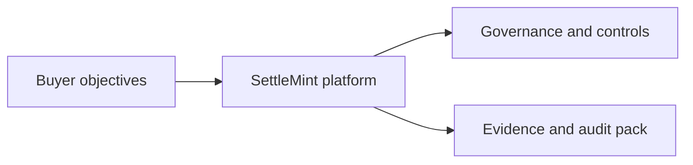

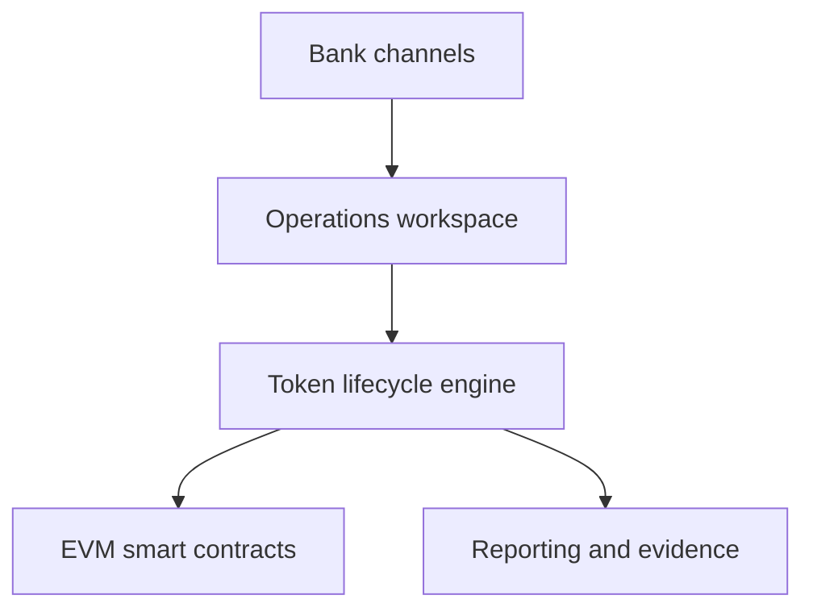

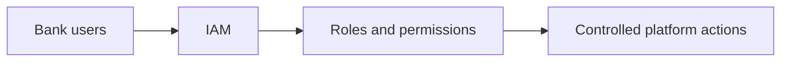

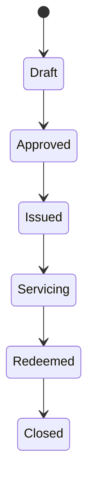

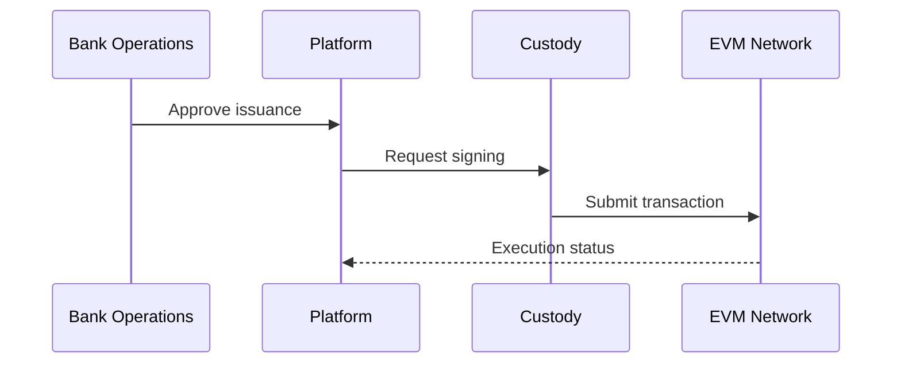

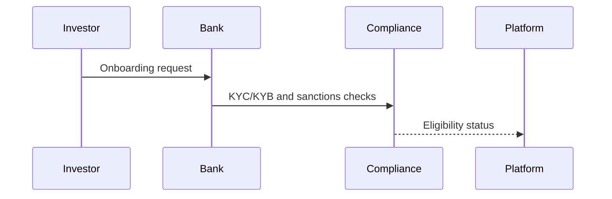

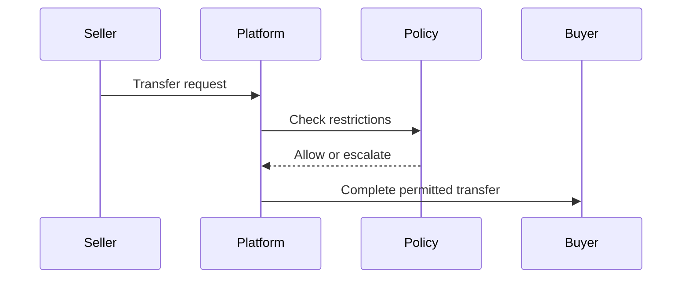

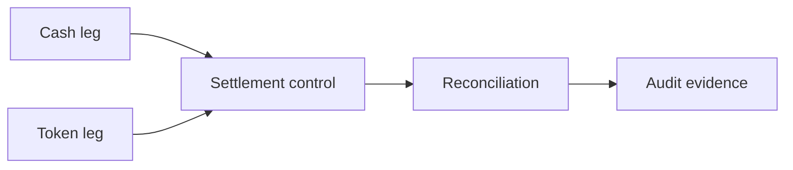

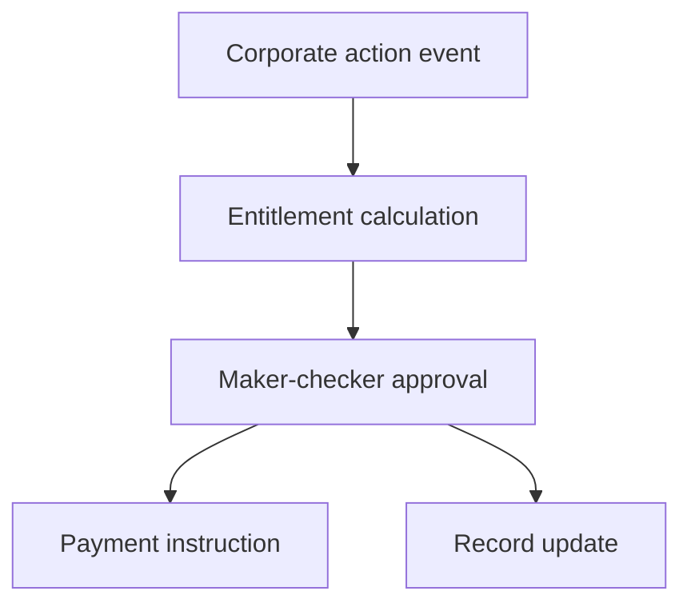

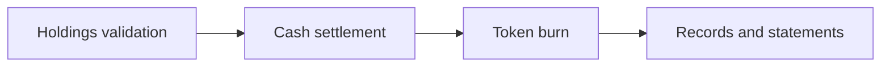

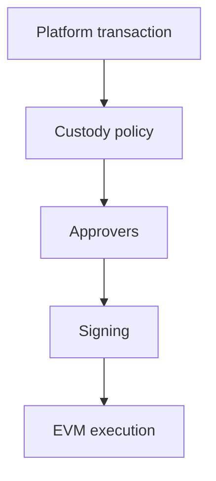

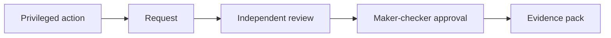

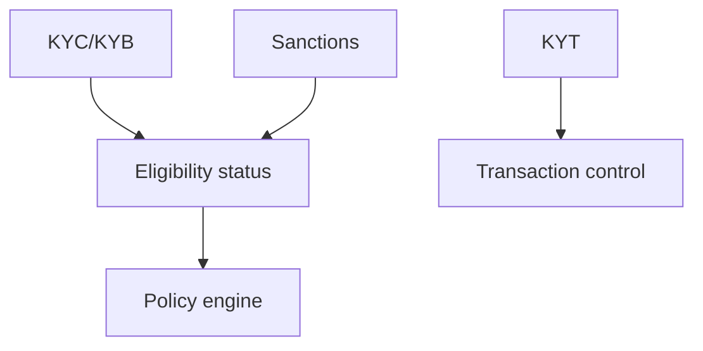

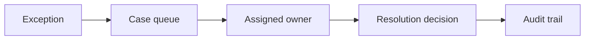

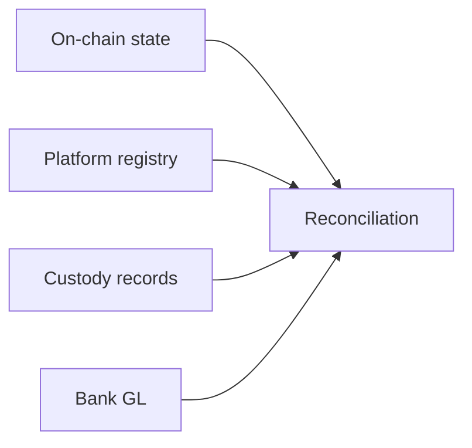

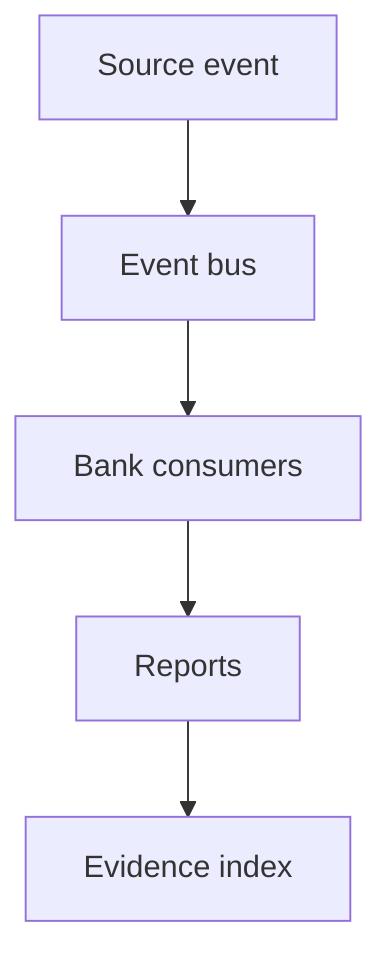

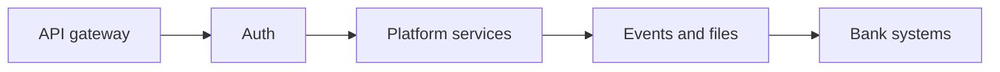

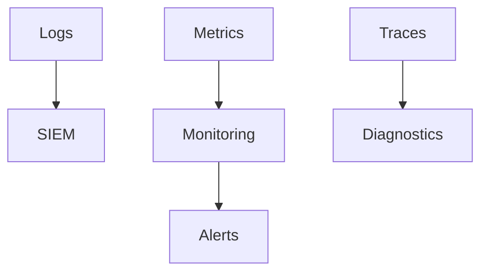

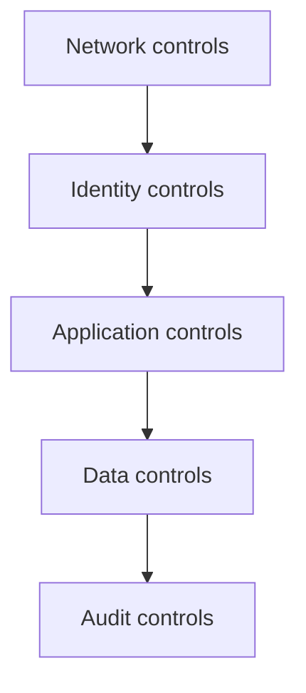

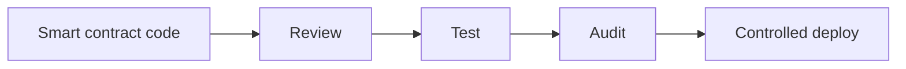

```mermaid
flowchart TB
  Vulnerability[Finding] --> Triage[Triage]
  Triage --> Fix[Remediation]
  Fix --> Verify[Verification]
  Verify --> Close[Closure evidence]
```

```mermaid
flowchart LR
  Incident[Incident] --> Triage[Triage]
  Triage --> Contain[Containment]
  Contain --> Recover[Recovery]
  Recover --> RCA[Root cause analysis]
```

```mermaid
flowchart TB
  Primary[Primary environment] --> Backup[Backups]
  Backup --> Restore[Restore test]
  Primary --> DR[DR environment]
  DR --> Service[Service continuity]
```

```mermaid
gantt
  title COLOSSUS implementation plan
  dateFormat  YYYY-MM-DD
  section Mobilise
  Discovery and design :a1, 2026-01-01, 14d
  section Build
  Configure and integrate :a2, after a1, 28d
  section Test
  Test and evidence :a3, after a2, 21d
  section Launch
  Cutover and hypercare :a4, after a3, 21d
```

```mermaid
flowchart LR
  SIT[SIT] --> UAT[UAT]
  UAT --> Security[Security testing]
  Security --> Performance[Performance testing]
  Performance --> Readiness[Go-live readiness]
```

```mermaid
flowchart TB
  Plan[Cutover plan] --> Freeze[Change freeze]
  Freeze --> Execute[Execute cutover]
  Execute --> Validate[Validate]
  Validate --> Rollback{Rollback needed?}
  Rollback -->|No| Hypercare[Hypercare]
  Rollback -->|Yes| Restore[Restore previous state]
```

```mermaid
flowchart LR
  User[Bank support user] --> L1[L1 triage]
  L1 --> L2[L2 platform support]
  L2 --> L3[L3 engineering]
  L3 --> RCA[RCA and fix]
```

```mermaid
flowchart TB
  Requirement[Buyer requirement] --> Response[Response posture]
  Response --> Evidence[Evidence item]
  Evidence --> Artifact[Artifact location]
  Artifact --> Gate[QA gate]
```

```mermaid
flowchart LR
  Assumption[Assumption] --> Owner[Owner]
  Owner --> DueDate[Decision date]
  DueDate --> Status[Open or closed]
```

```mermaid
flowchart TB
  Clarification[Clarification] --> Impact[Impact]
  Impact --> Commercial[Commercial effect]
  Impact --> Technical[Technical effect]
  Impact --> Legal[Legal effect]
```

```mermaid
flowchart LR
  Evidence[Evidence library] --> Index[Evidence index]
  Index --> Requirement[Requirement mapping]
  Index --> Annex[Annex reference]
```

```mermaid
flowchart TB
  Screenshot[Screenshot] --> Caption[Proof caption]
  Caption --> Requirement[Requirement link]
  Requirement --> Section[Proposal section]
```

```mermaid
flowchart LR
  Data[Data class] --> Location[Hosting location]
  Location --> Retention[Retention policy]
  Retention --> Deletion[Deletion process]
```

```mermaid
flowchart TB
  Outsourcing[Outsourcing control] --> Subcontractor[Subcontractor register]
  Subcontractor --> DueDiligence[Due diligence]
  DueDiligence --> Monitoring[Ongoing monitoring]
```

```mermaid
flowchart LR
  SLA[SLA] --> Measure[Measurement]
  Measure --> Report[Service report]
  Report --> Review[Service review]
```

```mermaid
flowchart TB
  Training[Training plan] --> Materials[Materials]
  Materials --> Sessions[Sessions]
  Sessions --> Signoff[Operational signoff]
```

```mermaid
flowchart LR
  Risk[Delivery risk] --> Mitigation[Mitigation]
  Mitigation --> Owner[Owner]
  Owner --> Status[Status]
```

```mermaid
flowchart TB
  Decision[Buyer decision] --> Dependency[Dependency]
  Dependency --> Schedule[Schedule impact]
  Schedule --> Register[Dependency register]
```

```mermaid
flowchart LR
  Matrix[Requirement matrix] --> Narrative[Narrative section]
  Narrative --> Annex[Annex evidence]
  Annex --> QA[Final QA]
```

```mermaid
flowchart TB
  Draft[Draft package] --> Template[Template validation]
  Template --> Render[PDF render]
  Render --> Scan[Placeholder and internal language scan]
  Scan --> Handoff[Controlled handoff]
```

### COLOSSUS Quality Gates

ATLAS must pass the normal proposal gates and the additional COLOSSUS-specific gates below:

| Gate | Requirement |
| --- | --- |
| Package completeness | All mandatory package components exist or are explicitly marked not applicable with rationale |
| Requirement traceability | Every buyer requirement maps to response posture, evidence, owner, caveat, and artifact location |
| Evidence status | Every material claim has an evidence class and status: attached, source-backed, approved for disclosure, or open |
| Visual sufficiency | Mandatory diagram inventory is complete or has documented substitutions |
| Screenshot sufficiency | Required product screenshots are present, uncropped unless approved, legible, captioned, and mapped to sections |
| Open-item honesty | All legal, commercial, security, certification, reference, deployment, data residency, SLA, and signatory gaps are visible |
| Annex consistency | Narrative, requirement matrix, clarifications, evidence index, and annexes do not contradict each other |
| Render QA | DOCX opens, PDF renders, page count is plausible, TOC placement is correct, and no blank-page run appears |
| Language QA | No internal process language, no unresolved placeholders, no unsupported roadmap claims, no hidden uncertainty |
| Final boardroom review | Weakest rendered pages receive page-level review and have a punch list or explicit pass |

### COLOSSUS Drafting Rule

COLOSSUS is finished only when the proposal can survive evaluator fragmentation. If security reads only the security annex, architecture reads only the architecture section, procurement reads only deviations and evidence, and the business sponsor reads only the executive summary, each reader must still understand what is being proposed, what is proven, what is assumed, what remains open, and who owns the next action.
